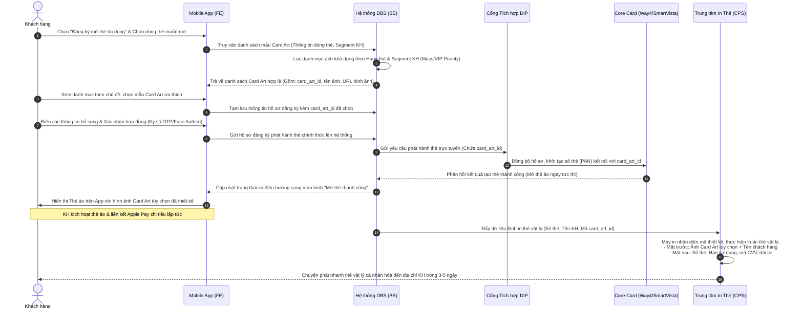

# TÀI LIỆU YÊU CẦU NGHIỆP VỤ (BUSINESS REQUIREMENT DOCUMENT - BRD)
## HÀNH TRÌNH TÙY CHỌN ẢNH HIỂN THỊ THẺ TÍN DỤNG KHI KHÁCH HÀNG ĐĂNG KÝ MỚI (PERSONALIZED CARD ART SELECTION)
**Mã tài liệu:** BRD-[CARD-008] Personalized Card Art Selection  
**Phân hệ:** Card Issuance - Onboarding  
**Phiên bản:** Ver 1.1  
**Ngày cập nhật:** 31/05/2026  
**Trạng thái:** Draft

---

## 1. LỊCH SỬ THAY ĐỔI TÀI LIỆU

Bảng ghi nhận toàn bộ quá trình cập nhật, chỉnh sửa nội dung tài liệu qua các phiên bản phát triển (MVP).

| Phiên bản | Ngày cập nhật | Người thực hiện | Người phê duyệt | Mô tả chi tiết thay đổi (A/M/D) |
| :--- | :--- | :--- | :--- | :--- |
| Ver 1.0 | 31/05/2026 | AI Senior PO Agent | Stakeholder | **[NEW]** Khởi tạo tài liệu đặc tả yêu cầu nghiệp vụ cho tính năng tùy chọn ảnh hiển thị (Card Art) của thẻ tín dụng khi đăng ký mới trực tuyến. |
| Ver 1.1 | 31/05/2026 | AI Senior PO Agent | Stakeholder | **[MODIFY]** Cập nhật toàn diện dựa trên phản hồi của QA Validator (Agent 2):<br>- Bổ sung đầy đủ 9 thuật ngữ mới vào bảng Glossary (Section 2).<br>- Tích hợp các chốt chặn ngầm bắt buộc (Face Authen QĐ 2345, Batch Time Check, OTP limits, Velocity Limits) vào Matrix Table (Section 5.1) và Business Rules (Section 5.2).<br>- Chuẩn hóa định dạng mã lỗi các Popup thông báo về chuẩn `[ERR_CARD_XXX]` (Section 6).<br>- Bổ sung thêm Section 10 "Tài liệu tham chiếu" hoàn chỉnh. |

---

## 2. BỘ THUẬT NGỮ NGHIỆP VỤ & GIẢI THÍCH TỪ NGỮ

Liệt kê và định nghĩa toàn bộ thuật ngữ chuyên ngành tài chính - ngân hàng và kỹ thuật được sử dụng trong phạm vi tài liệu này.

| STT | Thuật ngữ / Từ viết tắt | Giải thích ý nghĩa nghiệp vụ |
| :--- | :--- | :--- |
| 1 | **Card Art (CA)** | Thiết kế hình ảnh hiển thị ở mặt trước của thẻ tín dụng (cả thẻ vật lý và thẻ ảo). |
| 2 | **Card Art ID** | Mã định danh duy nhất của thiết kế ảnh thẻ trong hệ thống cơ sở dữ liệu để đối khớp in ấn và hiển thị. |
| 3 | **NTB** | New to Bank (Khách hàng mới hoàn toàn, chưa từng có thông tin tại ngân hàng). |
| 4 | **ETB** | Existing to Bank (Khách hàng hiện hữu, đã có mã CIF hoặc tài khoản tại ngân hàng). |
| 5 | **DBS** | Digibank Service (Hệ thống quản trị/cung cấp dịch vụ ngân hàng số). |
| 6 | **DIP** | Digital Integration Platform (Cổng kết nối tích hợp dữ liệu API / Middleware trung gian). |
| 7 | **Core Card** | Hệ thống quản lý thẻ cốt lõi của ngân hàng (ví dụ: Way4 hoặc SmartVista). |
| 8 | **CPS** | Card Personalization System (Hệ thống cá nhân hóa thẻ / Trung tâm in ấn phôi thẻ nhựa vật lý). |
| 9 | **STP** | Straight-Through Processing (Luồng xử lý tự động xuyên suốt 100%, không cần phê duyệt thủ công). |
| 10 | **Instant Digital Card** | Thẻ tín dụng phi vật lý (thẻ ảo) được mở và kích hoạt sử dụng ngay trên App Digibank sau khi duyệt hạn mức thành công. |
| 11 | **Full Back-side Printing** | Quy chuẩn in toàn bộ thông tin nhạy cảm của thẻ (Số thẻ, Ngày hết hạn, CVV) ở mặt sau thẻ vật lý nhằm tăng tính bảo mật và thẩm mỹ mặt trước. |
| 12 | **CIF** | Customer Information File (Mã định danh hồ sơ thông tin khách hàng duy nhất trên hệ thống Core Banking). |
| 13 | **OTP (One-Time Password)** | Mật khẩu xác thực sử dụng một lần gửi qua SMS hoặc sinh từ Smart OTP để xác nhận ký số giao dịch mở thẻ. |
| 14 | **API (Application Programming Interface)** | Giao diện lập trình ứng dụng dùng để kết nối và truyền nhận dữ liệu đồng bộ giữa các phân hệ hệ thống (App, DBS, DIP, Core Card). |
| 15 | **FE (Front-End)** | Giao diện người dùng hiển thị trực quan trên ứng dụng di động Mobile App Digibank. |
| 16 | **BE (Back-End)** | Hệ thống xử lý logic nghiệp vụ và dữ liệu phía sau (DBS, Core). |
| 17 | **PAN (Primary Account Number)** | Số tài khoản thẻ tín dụng duy nhất gồm 16 chữ số được in/khắc trên phôi thẻ. |
| 18 | **CVV (Card Verification Value)** | Mã bảo mật gồm 3 chữ số in ở mặt sau thẻ dùng để xác thực các giao dịch trực tuyến. |
| 19 | **JCB / Visa** | Các Tổ chức thẻ quốc tế liên kết với ngân hàng để phát hành thẻ và thanh toán toàn cầu. |
| 20 | **VIP (Very Important Person)** | Phân khúc khách hàng ưu tiên (Priority Banking) được cấp các đặc quyền dịch vụ và mẫu Card Art cao cấp. |

---

## 3. TỔNG QUAN HÀNH TRÌNH NGHIỆP VỤ

### 3.1. Mô tả User Story (US)
*   **As a** Khách hàng cá nhân thực hiện đăng ký mở thẻ tín dụng mới trên ứng dụng Mobile App Digibank.
*   **I want to** tùy chọn mẫu thiết kế ảnh hiển thị (Card Art) của thẻ tín dụng từ thư viện thiết kế độc quyền của ngân hàng.
*   **So that** sở hữu một chiếc thẻ tín dụng có diện mạo cá nhân hóa theo phong cách riêng, hiển thị đồng nhất cả trên ứng dụng ngân hàng số và bản thẻ vật lý được in ra.

### 3.2. Mục đích & Yêu cầu Kinh doanh (Business Objectives)
*   **Tối ưu hóa tỷ lệ chuyển đổi:** Thu hút đối tượng khách hàng trẻ tuổi (Gen Z, Millennials) bằng cách đưa yếu tố thời trang và phong cách cá nhân vào sản phẩm tài chính truyền thống, dự kiến tăng **15% - 20%** lượng thẻ mở mới trong năm đầu tiên.
*   **Số hóa toàn diện trải nghiệm khách hàng (STP):** Cung cấp giải pháp mở thẻ 100% online, cho phép kích hoạt và sử dụng thẻ ảo tức thì với Card Art đã chọn để tăng mức độ tương tác ban đầu.
*   **Nâng cao tính bảo mật vật lý:** Áp dụng công nghệ in thông tin nhạy cảm ở mặt sau giúp ngăn chặn rủi ro lộ thông tin khi thanh toán tại quầy hoặc rút tiền tại ATM.

### 3.3. Phạm vi Yêu cầu (Scope)
*   **In-Scope (Nằm trong phạm vi):**
    1.  Tích hợp bước lựa chọn thiết kế Card Art vào luồng đăng ký mở thẻ tín dụng trên Mobile App Digibank (cho cả luồng NTB và ETB).
    2.  Hiển thị kho thư viện ảnh thẻ (Card Art Library) phân chia theo các chủ đề: GenZ năng động, Tối giản (Minimalist), Sang trọng (Luxury/Priority), Nghệ thuật (Art)...
    3.  Thiết lập bộ lọc phân hạng hiển thị: Các thiết kế cao cấp (Luxury, Priority) chỉ hiển thị khi khách hàng đăng ký dòng thẻ Bạch Kim (Platinum) hoặc thuộc phân khúc khách hàng VIP.
    4.  Lưu trữ thông tin mã thiết kế thẻ `card_art_id` đi kèm suốt vòng đời của thẻ.
    5.  Tích hợp API chuyển tiếp thông tin `card_art_id` từ Mobile App -> DBS -> DIP -> Core Card -> CPS (Hệ thống in thẻ) để in ấn phôi thẻ vật lý cá nhân hóa.
    6.  Áp dụng quy chuẩn in thông tin bảo mật ở mặt sau thẻ vật lý (Full Back-side Printing) cho tất cả thẻ tùy chọn Card Art.
    7.  Cấp thẻ ảo (Instant Digital Card) hiển thị đúng hình Card Art đã chọn ngay sau khi hồ sơ được phê duyệt thành công trên App để liên kết Apple Pay và chi tiêu tức thì.
    8.  Cho phép khách hàng thay đổi thiết kế ảnh thẻ hiển thị trên App (miễn phí đối với thẻ ảo). Đối với thẻ vật lý, nếu muốn đổi mẫu ảnh mới sẽ thực hiện qua luồng yêu cầu phát hành lại thẻ (áp dụng phí phát hành lại tiêu chuẩn).
*   **Out-of-Scope (Nằm ngoài phạm vi MVP1):**
    1.  Tính năng cho phép khách hàng tự tải ảnh cá nhân từ thư viện ảnh điện thoại (để kiểm soát rủi ro bản quyền, thuần phong mỹ tục - hoãn lại MVP2).
    2.  Luồng đăng ký thẻ tại quầy giao dịch vật lý (tính năng chỉ áp dụng độc quyền trên ứng dụng Mobile App Digibank).
    3.  Thu phí tùy chọn Card Art khi mở mới thẻ (miễn phí cho tất cả KH đăng ký mới ở MVP1).

---

## 4. SƠ ĐỒ LUỒNG QUY TRÌNH NGHIỆP VỤ (MERMAID SEQUENCE DIAGRAM)

Dưới đây là sơ đồ chuỗi hành trình nghiệp To-be, thể hiện sự tương tác và luồng truyền nhận dữ liệu giữa Khách hàng, Mobile App, Hệ thống quản trị DBS, Cổng tích hợp DIP, Core Card và Trung tâm In thẻ vật lý (CPS):



---

## 5. ĐẶC TẢ CHI TIẾT LUỒNG HÀNH TRÌNH & BUSINESS RULES

- **Kênh thực hiện:** Mobile App Digibank.
- **Điều kiện đầu vào:**
    1.  Khách hàng đã đăng nhập ứng dụng Mobile App Digibank thành công.
    2.  Thiết bị di động của khách hàng vượt qua chốt chặn bảo mật (Jailbreak/Root Check).
    3.  Khách hàng được phê duyệt cấp hạn mức thẻ tín dụng trực tuyến (luồng Instant Approval) hoặc hoàn tất khai báo hồ sơ mở thẻ.

### 5.1. Bảng Chi Tiết Hành Trình Đăng Ký và Chọn Card Art (To-be Journey Matrix)

| Bước | PIC | Thao tác người dùng | Logic & Kiểm tra hệ thống (Business Rules) | Kết quả & Chuyển bước (Next Action) |
| :---: | :--- | :--- | :--- | :--- |
| **1** | Hệ thống | Khách hàng hoàn tất bước chọn Dòng sản phẩm thẻ (ví dụ: Thẻ JCB, Visa Signature...) và bấm `[Tiếp tục]`. | 1. Hệ thống DBS nhận diện mã dòng thẻ và thông tin phân khúc khách hàng của CIF hiện tại (Khách hàng thông thường - Mass hay Khách hàng VIP - Priority Banking). <br> 2. DBS gửi danh sách các mẫu ảnh thẻ hợp lệ tương ứng về ứng dụng. | Hiển thị màn hình thiết kế thẻ "Diện mạo thẻ của riêng bạn" -> Chuyển sang **Bước 2**. |
| **2** | Khách hàng | Khách hàng vuốt ngang duyệt qua các bộ sưu tập ảnh thẻ theo chủ đề (Gen Z, Tối giản, VIP...). Khách hàng chạm chọn thiết kế ưng ý. | 1. Hệ thống hiển thị trực quan bản mô phỏng 3D mặt trước thẻ vật lý (Front-side) với hình ảnh được lựa chọn kèm theo Họ và tên của khách hàng in chìm/nổi góc trái phía dưới. <br> 2. **Chốt chặn phân hạng (Segment Check):** Nếu khách hàng Mass cố gắng chọn thiết kế của dòng VIP Priority, hệ thống chặn hiển thị mẫu đó hoặc hiển thị khóa mờ và báo lỗi khi chạm vào [ERR_CARD_002]. | - Chọn mẫu thành công: Hệ thống ghi nhận giá trị `card_art_id` được chọn. Nút `[Xác nhận thiết kế]` được mở khóa (Enable) -> Chuyển sang **Bước 3**. |
| **3** | Khách hàng | Khách hàng bấm `[Xác nhận thiết kế]` để đi tiếp hành trình. | Hệ thống lưu trữ tạm thời mã `card_art_id` vào thông tin giỏ hàng đăng ký mở thẻ. Lưu vết trạng thái Drop-off để hỗ trợ Khôi phục hành trình trong vòng 15 ngày (nếu rớt luồng ở các bước sau thì khi quay lại vẫn giữ đúng Card Art đã chọn). | Chuyển hướng sang màn hình Xác nhận thông tin địa chỉ nhận thẻ vật lý và cài đặt các tính năng thẻ -> Chuyển sang **Bước 4**. |
| **4** | Khách hàng | Khách hàng nhập thông tin địa chỉ nhận thẻ vật lý, kiểm tra Điều khoản & Điều kiện (T&C) và ký số bằng Smart OTP/Face Authen. | 1. **Kiểm tra giờ chạy batch (Batch Time Check):** Nếu giao dịch diễn ra từ 22h00 - 01h00 sáng, DBS chặn thực hiện giao dịch và hiển thị popup thông báo bảo trì.<br>2. **Xác thực khuôn mặt sinh trắc học bắt buộc (Face Authen):** Khách hàng chụp ảnh khuôn mặt live để so khớp với chip CCCD/VNeID, tuân thủ nghiêm ngặt Quyết định 2345/QĐ-NHNN.<br>3. **Kiểm tra giới hạn OTP (OTP Limits Check):** Nếu nhập sai OTP liên tiếp $\ge 5$ lần, hệ thống khóa giao dịch mở thẻ trong 24 giờ.<br>4. Gọi API Core Card qua DIP để khởi tạo phát hành thẻ, liên kết mã `card_art_id` với số thẻ mới phát hành (PAN).<br>5. Mở và kích hoạt ngay thẻ ảo (Instant Digital Card) trên ứng dụng, áp dụng hạn mức chi tiêu tạm thời tối đa 50,000,000 VND/ngày cho đến khi kích hoạt thẻ vật lý. | - Phát hành thành công: Hiển thị màn hình thành công kèm ảnh Card Art của thẻ vừa mở -> Chuyển sang **Bước 5**.<br>- Nhập sai OTP $\ge 5$ lần: Khóa luồng trong ngày.<br>- Lỗi kết nối hệ thống: Hiển thị popup báo lỗi [ERR_CARD_009]. |
| **5** | Khách hàng | Khách hàng truy cập giao diện Quản lý thẻ trên App để sử dụng thẻ ảo. | 1. Hệ thống hiển thị ảnh thẻ ảo trên App khớp chính xác theo thiết kế `card_art_id` đã chọn tại Bước 2. <br> 2. Cho phép khách hàng liên kết thẻ ảo ngay lập tức vào Apple Pay để thanh toán chạm tại cửa hàng hoặc sao chép thông tin thẻ mua sắm online. <br> 3. Tự động đóng luồng đăng ký trực tuyến. | Hệ thống DBS tạo lệnh in thẻ vật lý cá nhân hóa gửi sang Trung tâm in thẻ (CPS). Khách hàng chờ nhận thẻ vật lý tại nhà sau 3 - 5 ngày. |

---

### 5.2. Các Quy Tắc Nghiệp Vụ Bổ Sung (System Business Rules & Security Gateways)

1.  **Quy chuẩn in ấn vật lý (Full Back-side Printing Constraint):**
    *   Mặt trước (Front-side) của phôi thẻ vật lý chỉ in duy nhất: Hình thiết kế Card Art đã chọn (toàn màn hình thẻ, không viền) và Họ tên khách hàng in chìm/nổi bằng chữ không dấu. Không in bất cứ thông tin nào khác bao gồm cả Số thẻ tín dụng (PAN), Ngày hết hạn và mã bảo mật (CVV).
    *   Mặt sau (Back-side) thẻ bắt buộc chứa đầy đủ: Dải từ, Chip thanh toán, Dải chữ ký khách hàng, và in chìm toàn bộ Số thẻ (16 chữ số), Ngày hết hạn (MM/YY), mã bảo mật CVV (3 chữ số) và Hotline hỗ trợ của ngân hàng.
2.  **Quy tắc khôi phục hành trình rớt luồng (Drop-off Recovery Rules):**
    *   If a customer drops off and returns within **15 days**, the system automatically recovers the application, pre-filling all information including the selected `card_art_id`.
    *   After 15 days, the application is purged and the customer must start from scratch.
3.  **Quy tắc quản lý vòng đời Card Art (Lifecycle & Deprecation Rules):**
    *   Khi một mẫu thiết kế Card Art cụ thể bị loại bỏ hoặc ngừng hỗ trợ in ấn vật lý do hết chiến dịch marketing (Trạng thái thiết kế đổi từ `ACTIVE` sang `DEPRECATED` trên DBS):
        *   **Đối với thẻ ảo đang hoạt động trên App:** Vẫn giữ nguyên hiển thị hình ảnh cũ để đảm bảo tính cá nhân hóa đã cam kết với khách hàng.
        *   **Đối với luồng phát hành lại thẻ vật lý (Mất/Hỏng/Gia hạn):** Hệ thống DBS kiểm tra nếu mã `card_art_id` của thẻ hiện tại ở trạng thái `DEPRECATED` -> Hiển thị Popup [ERR_CARD_001] yêu cầu khách hàng thực hiện thay đổi mẫu Card Art mới đang hoạt động (`ACTIVE`) trước khi cho phép xác nhận yêu cầu phát hành lại thẻ.
4.  **Quy tắc đổi thiết kế thẻ (Change Card Art Rules):**
    *   Khách hàng có thể thay đổi thiết kế ảnh hiển thị thẻ ảo trên App Digibank bất kỳ lúc nào thông qua menu `[Quản lý thẻ -> Đổi thiết kế thẻ]`.
    *   Tính năng đổi thiết kế thẻ ảo hiển thị trên App là **miễn phí**.
    *   Nếu khách hàng yêu cầu in lại thẻ vật lý theo mẫu thiết kế mới đổi, hệ thống sẽ thực hiện thu phí phát hành lại thẻ (ví dụ: 100,000 VND trừ trực tiếp vào tài khoản thanh toán nguồn).
5.  **Xác thực sinh trắc học Face Authen (Tuân thủ QĐ 2345/QĐ-NHNN):**
    *   Khi thực hiện phát hành thẻ trực tuyến, hệ thống bắt buộc yêu cầu xác thực khuôn mặt sinh trắc học (Face Authen). 
    *   Ảnh khuôn mặt chụp live (liveness detection) của khách hàng trên thiết bị di động phải được đối khớp chính xác với ảnh chân dung sinh trắc học đã lưu trữ trong chip CCCD (thông qua kết nối NFC đọc thẻ) hoặc dữ liệu định danh được chia sẻ từ ứng dụng VNeID của Bộ Công An, đảm bảo tuân thủ nghiêm ngặt Quyết định 2345/QĐ-NHNN của Ngân hàng Nhà nước Việt Nam đối với hành trình đăng ký mở tài khoản và sản phẩm tài chính trên kênh số.
6.  **Giờ vận hành hệ thống và xử lý Batch (Batch Time Check):**
    *   Hệ thống kiểm tra giờ vận hành (Batch Time Check): Từ **22h00 đến 01h00 hàng ngày** (khung giờ chạy đối soát, chạy batch cuối ngày của hệ thống Core Banking và Core Card).
    *   Nếu khách hàng nhấn xác nhận phát hành thẻ trong khung giờ này, hệ thống sẽ chặn giao dịch và hiển thị popup thông báo hệ thống bảo trì định kỳ, tự động lưu tạm hồ sơ ở trạng thái nháp và kích hoạt luồng hậu kiểm tự động khi hệ thống mở lại, hoặc hướng dẫn khách hàng quay lại đăng ký sau 01h00.
7.  **Giới hạn số lần thử lại OTP (OTP Retry Limits):**
    *   Khách hàng chỉ được phép nhập sai mã xác thực OTP tối đa **5 lần liên tiếp**.
    *   Nếu vượt quá giới hạn 5 lần, giao dịch ký số mở thẻ tín dụng hiện tại sẽ bị khóa ngay lập tức trong vòng 24 giờ vì lý do bảo mật.
    *   Khách hàng có thể yêu cầu gửi lại OTP tối đa **3 lần** trong một phiên giao dịch; nếu quá 3 lần yêu cầu gửi lại mà vẫn chưa xác thực thành công, hành trình sẽ tự động bị hủy và đưa về trạng thái rớt luồng (drop-off).
8.  **Hạn mức giao dịch ban đầu cho thẻ ảo (Velocity Limits):**
    *   Để phòng ngừa rủi ro gian lận trực tuyến ngay sau khi phát hành thẻ, thẻ phi vật lý (Instant Digital Card) khi mới được kích hoạt và chưa kích hoạt thẻ vật lý sẽ bị áp dụng hạn mức chi tiêu tạm thời tối đa **50,000,000 VND/ngày**.
    *   Hạn mức chi tiêu ngày này sẽ tự động được nâng lên đúng hạn mức phê duyệt chính thức của thẻ ngay sau khi khách hàng nhận và kích hoạt thành công thẻ vật lý bằng cách quét mã QR giao kèm.

---

## 6. QUY CHUẨN THÔNG BÁO POPUP LỖI TRÊN GIAO DIỆN DI ĐỘNG

Đặc tả chi tiết nội dung văn bản hiển thị (UI Copy) của các trường hợp phát sinh ngoại lệ trong luồng để Dev và QA/QC thực hiện cấu hình chính xác:

### Popup lỗi [ERR_CARD_001]: Thiết kế thẻ cũ đã ngừng hỗ trợ in
*   **Tiêu đề (Title):** Thiết kế thẻ cũ đã ngừng hỗ trợ in
*   **Nội dung mô tả (Content):** Rất tiếc, mẫu thiết kế ảnh thẻ hiện tại của Quý khách đã hết hạn chương trình và không còn hỗ trợ in phôi vật lý mới. Để tiếp tục yêu cầu phát hành lại thẻ vật lý, Quý khách vui lòng bấm nút "Chọn mẫu mới" dưới đây để cập nhật diện mạo thẻ mới thời thượng hơn hoàn toàn miễn phí trên App.
*   **Nút hành động (CTA):** 
    *   `[Chọn mẫu mới]`: Điều hướng khách hàng về thư viện chọn Card Art đang khả dụng của dòng thẻ hiện tại.
    *   `[Đóng]`: Đóng popup và quay lại màn hình Quản lý thẻ hiện tại.

### Popup lỗi [ERR_CARD_002]: Mass Customer chọn mẫu VIP
*   **Tiêu đề (Title):** Bộ sưu tập thẻ đặc quyền
*   **Nội dung mô tả (Content):** Bộ sưu tập thiết kế thẻ "Signature & Priority" này chỉ áp dụng độc quyền cho hội viên MSB Priority hoặc dòng thẻ tín dụng hạng Bạch Kim. Quý khách vui lòng chọn các thiết kế thời thượng khác trong bộ sưu tập "GenZ" hoặc "Tối giản" để tiếp tục đăng ký mở thẻ.
*   **Nút hành động (CTA):** 
    *   `[Đã hiểu]`: Đóng popup và đưa người dùng quay lại màn hình thư viện ảnh thẻ để chọn mẫu khác.

### Popup lỗi [ERR_CARD_009]: Lỗi kết nối khởi tạo thẻ
*   **Tiêu đề (Title):** Đăng ký chưa hoàn tất
*   **Nội dung mô tả (Content):** Hệ thống đang gặp gián đoạn kết nối trong quá trình khởi tạo thông tin thẻ tín dụng của Quý khách. Hồ sơ của Quý khách đã được lưu tạm. Vui lòng thử lại sau ít phút hoặc liên hệ Hotline 1900xxxx để được hỗ trợ kiểm tra trạng thái phê duyệt.
*   **Nút hành động (CTA):** 
    *   `[Thử lại]`: Tự động gọi lại API tạo thẻ.
    *   `[Đóng]`: Quay về trang chủ Digibank.

---

## 7. ĐẶC TẢ TÍCH HỢP DỮ LIỆU & DATA MAPPING SCHEMAS

Đặc tả chi tiết cấu trúc truyền nhận thông tin API giữa các hệ thống FE Mobile App, BE DBS và Middleware DIP phục vụ tích hợp.

### Bảng 7.1: API Truy vấn danh sách Card Art khả dụng (Request & Response)
*   **API Endpoint:** `/api/v1/card/art-gallery`
*   **Method:** `GET`
*   **Request Params:**

| Tên Trường (Tiếng Việt) | Mã trường hệ thống | Kiểu dữ liệu | Thuộc tính (M/O) | Mô tả logic / Quy tắc nguồn |
| :--- | :--- | :--- | :---: | :--- |
| Mã dòng thẻ đăng ký | `card_product_code` | String | M | Mã dòng thẻ KH chọn mở (ví dụ: `VISA_PLATINUM`, `JCB_STANDARD`). |
| Phân khúc khách hàng | `customer_segment` | String | M | Phân khúc KH từ CIF lấy sau đăng nhập (giá trị: `MASS`, `PRIORITY`). |

*   **Response Body (JSON):**
```json
{
  "response_code": "00",
  "message": "Success",
  "categories": [
    {
      "category_name": "GenZ Năng Động",
      "designs": [
        {
          "card_art_id": "CA_GENZ_001",
          "card_art_name": "Hơi thở Vũ trụ (Cosmic Vibe)",
          "front_image_url": "https://cdn.msb.com.vn/card-art/cosmic-vibe.png",
          "status": "ACTIVE"
        },
        {
          "card_art_id": "CA_GENZ_002",
          "card_art_name": "Cyberpunk Neon",
          "front_image_url": "https://cdn.msb.com.vn/card-art/cyberpunk.png",
          "status": "ACTIVE"
        }
      ]
    },
    {
      "category_name": "Tối giản (Minimalist)",
      "designs": [
        {
          "card_art_id": "CA_MIN_001",
          "card_art_name": "Trắng Bắc Cực (Arctic White)",
          "front_image_url": "https://cdn.msb.com.vn/card-art/arctic-white.png",
          "status": "ACTIVE"
        }
      ]
    }
  ]
}
```

### Bảng 7.2: Dữ liệu API Khởi tạo/Phát hành thẻ gửi từ DBS lên DIP/Core Card (Request)
*   **API Endpoint:** `/api/v1/card/issue-online`
*   **Method:** `POST`

| Tên Trường (Tiếng Việt) | Mã trường hệ thống | Kiểu dữ liệu | Thuộc tính (M/O) | Mô tả logic / Quy tắc nguồn |
| :--- | :--- | :--- | :---: | :--- |
| Số CIF Khách hàng | `cif_number` | String | M | Mã định danh khách hàng trên hệ thống Core Banking. |
| Mã dòng thẻ đăng ký | `card_product_code` | String | M | Dòng thẻ khách hàng lựa chọn phát hành. |
| Mã thiết kế Card Art | `card_art_id` | String | M | Mã thiết kế ảnh thẻ khách hàng đã chọn tại màn hình đăng ký bước 2. |
| Họ tên in trên thẻ | `embossed_name` | String | M | Họ tên khách hàng in chìm/nổi không dấu (ví dụ: `NGUYEN VAN A`). |
| Địa chỉ nhận thẻ vật lý | `delivery_address` | String | M | Địa chỉ nhận thẻ vật lý của khách hàng đã khai báo. |

---

## 8. CẤU TRÚC THÔNG BÁO HÀNH TRÌNH ĐA KÊNH (MULTI-CHANNEL NOTI)

Để đảm bảo trải nghiệm liền mạch và giữ chân khách hàng (User Engagement), thiết lập chiến lược thông báo như sau:

### 8.1. Thông báo đẩy trong ứng dụng (In-app Push Notification - Noti Center)
*   **Trường hợp kích hoạt:** Ngay sau khi hệ thống Core phê duyệt cấp hạn mức và phát hành thẻ ảo thành công (Bước 4).
*   **Tiêu đề:** Thẻ tín dụng cá nhân hóa của bạn đã sẵn sàng!
*   **Nội dung:** Chúc mừng Quý khách! Thẻ tín dụng `{card_product_code}` với thiết kế độc bản `{card_art_name}` của Quý khách đã được kích hoạt thành công dạng ảo. Quý khách có thể bắt đầu chi tiêu và liên kết Apple Pay ngay lập tức trên ứng dụng Digibank. Thẻ vật lý đang được in ấn và sẽ gửi tới Quý khách sau 3 - 5 ngày làm việc!

### 8.2. Thông báo qua tin nhắn viễn thông SMS (Khi hoàn tất giao thẻ vật lý)
*   **Trường hợp kích hoạt:** Khi đơn vị chuyển phát bàn giao thẻ vật lý cá nhân hóa thành công tới tay khách hàng.
*   **Nội dung:** `MSB Digibank: The tin dung vat ly ca nhan hoa {card_product_code} mau thiet ke {card_art_name} da duoc giao toi Quy khach thanh cong. Quy khach vui long mo App, quet ma QR de kich hoat the vat ly va trai nghiem ngay! Hotline 1900xxxx.`

---

## 9. TIÊU CHÍ PHI CHỨC NĂNG (NON-FUNCTIONAL REQUIREMENTS)

Các chỉ số kỹ thuật hệ thống bắt buộc phải đáp ứng để đảm bảo tính ổn định, tốc độ và trải nghiệm mượt mà cho hành trình:

*   **Thời gian tải ảnh mẫu (Image SLA):** Thời gian phản hồi của API truy vấn kho ảnh `/api/v1/card/art-gallery` phải $\le 1.5$ giây. Các đường link hình ảnh (`front_image_url`) phải được lưu trữ trên CDN hiệu năng cao của ngân hàng nhằm đảm bảo tải nhanh và tối ưu hóa dung lượng hình ảnh dưới 500KB để không gây đứng/lag ứng dụng trên thiết bị di động.
*   **Độ chính xác đối soát in ấn:** Tỷ lệ đối soát khớp đúng giữa mã `card_art_id` lưu trên Core Card và mã phôi in thực tế tại máy in CPS của Trung tâm cá nhân hóa thẻ phải đạt tuyệt đối **100%**. Quy trình đối soát mã phải được kiểm tra tự động qua mã vạch (Barcode/QR code) gắn trên thẻ trung gian trước khi chuyển giao vận chuyển.
*   **Khả năng bảo mật thông tin nhạy cảm:** Mọi thông tin thẻ truyền nhận qua API từ Mobile App lên DBS và Core Card bắt buộc phải được mã hóa đầu-cuối (End-to-End Encryption) và che giấu thông tin hiển thị (Masking) số thẻ trên UI (chỉ hiển thị dạng `**** **** **** 1234`), ngoại trừ khi khách hàng xác thực OTP thành công mới được xem thông tin chi tiết đầy đủ của thẻ ảo.

---

## 10. TÀI LIỆU THAM CHIẾU

Dưới đây là các tài liệu nghiệp vụ, văn bản quy định và tài liệu kỹ thuật liên quan làm căn cứ xây dựng và tích hợp tính năng:

| STT | Tên tài liệu / Văn bản pháp lý | Đơn vị ban hành | Mã hiệu tài liệu / Chi tiết tham chiếu |
| :---: | :--- | :--- | :--- |
| 1 | **Quyết định số 2345/QĐ-NHNN** | Ngân hàng Nhà nước Việt Nam | Ban hành ngày 18/12/2023 về việc triển khai các giải pháp an toàn, bảo mật trong thanh toán trực tuyến và thanh toán thẻ ngân hàng. |
| 2 | **Tài liệu Đặc tả API Tích hợp Phát hành Thẻ trực tuyến** | Khối Công nghệ Thông tin (IT) | `IT-SPEC-CARD-API` / Phiên bản Ver 2.4 |
| 3 | **Đặc tả Thiết kế Giao diện UI/UX Personalized Card Art Flow** | Khối Sáng tạo & Trải nghiệm khách hàng | [Figma Link (UI/UX Personalized Card Art Flow)](https://figma.com/file/personalize-card-art-flow) |
| 4 | **Sơ đồ Luồng Nghiệp vụ Card Issuance To-be Flow** | Đội ngũ Phân tích nghiệp vụ (BA/PO) | [Miro Link (Miro Workspace - Card Issuance To-be Flow)](https://miro.com/app/board/card-issuance-tobe-flow) |
