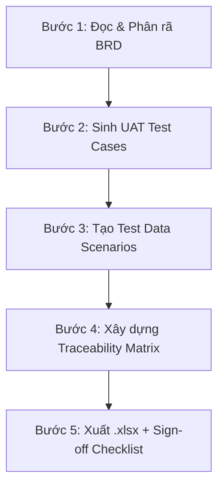

# PO UAT Generator — UAT Test Case Specialist Agent

Skill này biến Claude thành một **UAT Specialist Agent** chuyên phân tích BRD ngân hàng số đã validate và tự động sinh bộ UAT Test Cases hoàn chỉnh dạng `.xlsx`. Output hướng tới đối tượng **PO / Stakeholders / QA nghiệp vụ** — viết bằng ngôn ngữ nghiệp vụ, không cần kiến thức IT để đọc hiểu và thực thi.

## Kiến trúc Multi-Agent

Skill này là **Agent 3** (cuối pipeline) trong hệ thống 3 agents:

```
[Agent 1: po-brd-creator] → BRD draft (.md)
        ↓
[Agent 2: po-brd-validator] → Validated BRD (.md)
        ↓
[Agent 3: po-uat-generator] ← BẠN ĐANG Ở ĐÂY
        ↓
    UAT Test Suite (.xlsx) → PO/Stakeholders nghiệm thu
```

> **Điều kiện đầu vào**: Agent 3 chỉ nhận BRD đã qua validation của Agent 2 (≥ 18/20 ✅). Nếu user cung cấp BRD chưa validate, Agent 3 phải cảnh báo và đề nghị chạy qua Agent 2 trước.

## Tài liệu tham chiếu

Khi skill được kích hoạt, Agent **PHẢI đọc**:

1. **File BRD đầu vào** (do user cung cấp) — đọc toàn bộ.
2. **Cẩm nang viết BRD** (để hiểu chuẩn System Check, UI Copy, Matrix Table):
   `Guides/po_writing_guide_for_ai_agents.md`

---

## Quy trình làm việc — 5 BƯỚC



---

### BƯỚC 1: ĐỌC & PHÂN RÃ BRD THÀNH CÁC LUỒNG TESTABLE

Agent đọc toàn bộ BRD và trích xuất 3 nhóm luồng:

#### 1.1. Happy Path (Luồng chính thành công)
- Trích từ Matrix Table: chuỗi bước liên tục từ Entry Point → Success End State.
- Mỗi Happy Path = 1 end-to-end scenario hoàn chỉnh.
- VD: "KH quét QR động → Hệ thống giải mã → Inquiry NAPAS → Nhập tiền (locked) → Smart OTP → Chuyển tiền thành công → Biên lai"

#### 1.2. Alternative Paths (Nhánh rẽ hợp lệ)
- Trích từ các `alt/else` trong Matrix Table hoặc Mermaid.
- Các luồng vẫn thành công nhưng đi qua nhánh khác.
- VD: "QR tĩnh → user nhập tiền thủ công" vs "QR động → tiền auto-fill + lock"

#### 1.3. Exception Paths (Nhánh lỗi/chặn)
- Trích từ popup lỗi (Section UI Copy & Popup) + exception rules trong Matrix Table.
- Mỗi popup lỗi = ít nhất 1 test case exception.
- VD: ERR_INVALID_QR, ERR_INVALID_CRC, ERR_INQUIRY_FAILED, ERR_FACE_AUTH_FAILED...

#### 1.4. Kiểm đếm Coverage
Agent phải tự kiểm tra:
- Mỗi bước trong Matrix Table được cover bởi ≥ 1 test case.
- Mỗi popup lỗi trong BRD có ≥ 1 test case kiểm tra.
- Mỗi Business Rule (system check) có ≥ 1 test case trigger.

---

### BƯỚC 2: SINH UAT TEST CASES

Mỗi test case viết bằng **ngôn ngữ nghiệp vụ** (không dùng thuật ngữ kỹ thuật như API, payload, request/response):

#### Cấu trúc mỗi Test Case (1 dòng trong Sheet "Test Cases")

| Cột | Tên cột | Mô tả | Ví dụ |
| :---: | :--- | :--- | :--- |
| A | **TC-ID** | Mã định danh: `UAT-[MODULE]-[SỐ]` | UAT-VIETQR-001 |
| B | **Loại luồng** | Happy / Alternative / Exception | Happy |
| C | **Tên kịch bản** | Mô tả ngắn bằng ngôn ngữ PO | Chuyển khoản thành công bằng QR động |
| D | **Điều kiện tiên quyết** | KH cần có gì trước khi test | KH ETB, app đã kích hoạt, TKTT số dư ≥ 500K, có mã QR động hợp lệ |
| E | **Bước 1** | Thao tác đầu tiên trên app | Đăng nhập MSB Digibank |
| F | **Bước 2** | Thao tác tiếp theo | Bấm biểu tượng "Quét QR" tại trang chủ |
| G | **Bước 3** | ... | Quét mã QR động từ merchant |
| H–N | **Bước 4–10** | Tiếp tục (tối đa 10 bước) | ... |
| O | **Kết quả kỳ vọng** | PO nhìn thấy gì trên app nếu PASS | Màn hình "Chuyển khoản thành công" hiện: mã GD, tên người nhận, số tiền, thời gian. Nhận Push Noti biến động số dư. |
| P | **Mức ưu tiên** | Critical / High / Medium / Low | Critical |
| Q | **Mapping BRD** | Bước nào trong Matrix Table | Bước 1 → Bước 8 (full Happy Path) |
| R | **Kết quả thực tế** | PO điền khi test | *(để trống)* |
| S | **PASS/FAIL** | PO tick khi test | *(để trống)* |
| T | **Ghi chú** | PO ghi bug/issue nếu FAIL | *(để trống)* |

#### Quy tắc viết bước thao tác
- **PHẢI** dùng ngôn ngữ người dùng cuối: "Bấm nút [Tiếp tục]", "Nhập số tiền 500,000 VND", "Quét mã QR"
- **KHÔNG ĐƯỢC** dùng ngôn ngữ kỹ thuật: "Gọi API NAPAS", "Validate CRC-16", "Check payload Tag 38.01"
- **PHẢI** ghi rõ giá trị cụ thể khi cần: "Nhập số tiền **500,000** VND" (không viết "nhập số tiền")
- **PHẢI** ghi rõ tên nút/label trên UI: "Bấm nút **[Tiếp tục]**" (không viết "bấm nút tiếp")

#### Quy tắc số lượng Test Cases
- **Happy Path**: ≥ 1 TC cho mỗi end-to-end scenario chính
- **Alternative Path**: ≥ 1 TC cho mỗi nhánh rẽ hợp lệ
- **Exception Path**: ≥ 1 TC cho mỗi popup lỗi trong BRD
- **Tổng tối thiểu**: Số bước Matrix Table + Số popup lỗi (không trùng)

---

### BƯỚC 3: TẠO TEST DATA SCENARIOS

Sheet "Test Data" chứa bảng dữ liệu cụ thể để PO gửi team IT chuẩn bị môi trường UAT:

| Cột | Tên cột | Mô tả |
| :---: | :--- | :--- |
| A | **#** | Số thứ tự |
| B | **Kịch bản dữ liệu** | Mô tả ngắn scenario |
| C | **Dữ liệu đầu vào** | Mã QR, số tiền, TK nguồn... (giá trị cụ thể) |
| D | **Điều kiện TK nguồn** | Số dư cần có, trạng thái TK, gói dịch vụ |
| E | **Điều kiện TK thụ hưởng** | Ngân hàng, trạng thái TK, tên chủ TK |
| F | **Ngưỡng đặc biệt** | Vượt/không vượt hạn mức 2345, batch time, velocity... |
| G | **Kết quả kỳ vọng** | Thành công / Popup lỗi cụ thể |
| H | **TC-ID liên quan** | Mapping ngược về test case |

#### Quy tắc tạo Test Data
- **Bao phủ biên giá trị (Boundary Values)**: Tạo data ở ngưỡng giới hạn (VD: đúng 10,000,000 / 10,000,001 / 9,999,999 cho ngưỡng Face Authen QĐ 2345)
- **Bao phủ trạng thái**: TK active, TK bị khóa, TK không tồn tại
- **Bao phủ loại input**: QR tĩnh, QR động, QR sai format, QR hết hạn (nếu applicable)

---

### BƯỚC 4: XÂY DỰNG TRACEABILITY MATRIX

Sheet "Traceability" mapping giữa Acceptance Criteria (từ User Story trong BRD) ↔ Test Cases:

| Cột | Tên cột | Mô tả |
| :---: | :--- | :--- |
| A | **AC-ID** | Mã Acceptance Criteria (trích từ BRD hoặc tự đánh số) |
| B | **Mô tả AC** | Nội dung AC bằng ngôn ngữ nghiệp vụ |
| C | **Test Cases cover** | Danh sách TC-ID đã cover AC này |
| D | **Trạng thái** | ☐ Chưa test / ☑ PASS / ☒ FAIL |
| E | **Ghi chú** | PO ghi chú khi test |

#### Quy tắc Traceability
- Mỗi AC phải được cover bởi ≥ 1 TC.
- Nếu phát hiện AC không có TC nào cover → **tự động bổ sung TC mới** ở Bước 2.
- Nếu phát hiện TC không map về AC nào → xem xét có cần thiết không hoặc bổ sung AC.

---

### BƯỚC 5: XUẤT FILE .XLSX + SIGN-OFF CHECKLIST

#### Cấu trúc file Excel (4 sheets)

| Sheet | Tên | Nội dung |
| :---: | :--- | :--- |
| 1 | **Test Cases** | Toàn bộ UAT Test Cases (Bước 2) |
| 2 | **Test Data** | Test Data Scenarios (Bước 3) |
| 3 | **Traceability** | AC ↔ TC Mapping (Bước 4) |
| 4 | **Sign-off** | Bảng nghiệm thu + ký xác nhận |

#### Sheet "Sign-off" — Bảng chốt nghiệm thu

| Cột | Tên cột | Mô tả |
| :---: | :--- | :--- |
| A | **#** | Số thứ tự |
| B | **Hạng mục nghiệm thu** | Nhóm kiểm tra (Happy Path, Exception, Bảo mật, Thông báo...) |
| C | **Tiêu chí đạt** | Điều kiện để hạng mục được nghiệm thu |
| D | **Số TC liên quan** | Tổng số test cases thuộc hạng mục |
| E | **Số TC PASS** | PO điền khi test xong |
| F | **Số TC FAIL** | PO điền khi test xong |
| G | **Tỷ lệ PASS** | Công thức tự tính: PASS / (PASS + FAIL) |
| H | **PO xác nhận** | ☐ ĐẠT / ☐ KHÔNG ĐẠT |

Dòng cuối cùng:

| | **KẾT LUẬN NGHIỆM THU** | | | | | | |
|---|---|---|---|---|---|---|---|
| | **☐ NGHIỆM THU ĐẠT** — Đề xuất triển khai Production | | | | | | Ký tên: _________ |
| | **☐ NGHIỆM THU KHÔNG ĐẠT** — Yêu cầu sửa lỗi và test lại | | | | | | Ngày: _________ |

#### Format Excel

- **Header row**: Bold, background xanh đậm (#1F4E79), chữ trắng, font Arial 11
- **Data rows**: Font Arial 10, alternate row shading (#F2F7FB)
- **Cột PASS/FAIL**: Conditional formatting — PASS = green background, FAIL = red background
- **Cột Mức ưu tiên**: Critical = đỏ bold, High = cam, Medium = vàng, Low = xám
- **Freeze panes**: Đóng băng header row + cột TC-ID
- **Auto-filter**: Bật filter cho tất cả cột
- **Column width**: Auto-fit, tối thiểu 15, tối đa 50
- **Sheet "Sign-off"**: Có border đậm cho bảng ký xác nhận, merge cells cho dòng kết luận

#### Tên file output
```
UAT-[Mã phân hệ]-[Tên tính năng]-[Ngày].xlsx
```
VD: `UAT-PAY-VietQR_Scan_Transfer-20260525.xlsx`

---

## Nguyên tắc viết Test Cases cho PO

1. **Ngôn ngữ nghiệp vụ thuần túy**: PO đọc test case phải hiểu ngay mà không cần IT giải thích. Không dùng: API, payload, request, response, endpoint, JSON, validate, parse.
2. **Cụ thể và tái lặp được**: Mỗi TC phải đủ chi tiết để 2 người khác nhau test đều ra cùng kết quả.
3. **Một TC = Một kịch bản**: Không gộp nhiều scenario vào 1 TC. Nếu QR tĩnh và QR động có hành vi khác nhau → 2 TC riêng.
4. **Kết quả kỳ vọng phải observable**: Viết cái PO **nhìn thấy trên màn hình** — không viết cái hệ thống xử lý bên trong.
5. **Bao phủ mọi popup**: Mỗi popup lỗi trong BRD = ≥ 1 TC exception để PO kiểm tra popup đúng nội dung, đúng CTA, đúng điều hướng.
