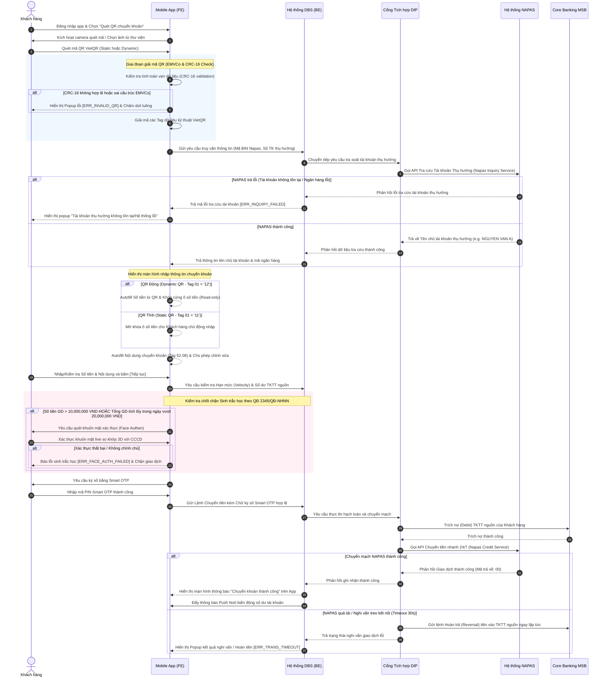

# HÀNH TRÌNH QUÉT MÃ QR CHUYỂN KHOẢN THEO TIÊU CHUẨN VIETQR TRÊN MOBILE APP (VIETQR SCAN & TRANSFER)
## TÀI LIỆU YÊU CẦU NGHIỆP VỤ (BUSINESS REQUIREMENT DOCUMENT - BRD)
**Mã tài liệu:** DCTBR-[PAY-008] BRD VietQR Scan & Transfer  
**Phân hệ:** Daily Banking - Payment  
**Phiên bản:** Ver 1.0  
**Ngày cập nhật:** 22/05/2026  
**Trạng thái:** Released

---

## 1. LỊCH SỬ THAY ĐỔI TÀI LIỆU

Bảng ghi nhận toàn bộ quá trình cập nhật, chỉnh sửa nội dung tài liệu qua các phiên bản phát triển (MVP).

| Phiên bản | Ngày cập nhật | Người thực hiện | Người phê duyệt | Mô tả chi tiết thay đổi (A/M/D) |
| :--- | :--- | :--- | :--- | :--- |
| Ver 1.0 | 22/05/2026 | AI PO Agent | Stakeholder Approved | **[NEW]** Khởi tạo tài liệu đặc tả hoàn chỉnh cho tính năng quét mã QR chuyển khoản liên ngân hàng 24/7 theo tiêu chuẩn VietQR (NAPAS) trên ứng dụng di động MSB Digibank. |

---

## 2. BỘ THUẬT NGỮ NGHIỆP VỤ & GIẢI THÍCH TỪ NGỮ

| STT | Thuật ngữ / Từ viết tắt | Giải thích ý nghĩa nghiệp vụ |
| :--- | :--- | :--- |
| 1 | **VietQR** | Tiêu chuẩn mã QR chung cho các dịch vụ thanh toán và chuyển khoản tại Việt Nam do NAPAS ban hành, xây dựng trên tiêu chuẩn quốc tế EMVCo. |
| 2 | **NAPAS** | National Payment Corporation of Vietnam (Công ty Cổ phần Thanh toán Quốc gia Việt Nam) - Đơn vị chuyển mạch tài chính quốc gia. |
| 3 | **EMVCo** | Tổ chức tiêu chuẩn hóa quốc tế về công nghệ thẻ thanh toán và thanh toán QR di động (đồng sáng lập bởi Europay, Mastercard, Visa, v.v.). |
| 4 | **CIF** | Customer Information File (Mã hồ sơ thông tin khách hàng duy nhất trên Core Banking MSB). |
| 5 | **TKTT** | Tài khoản thanh toán nguồn trích nợ tiền chuyển khoản của khách hàng tại MSB. |
| 6 | **DBS** | Digibank Service (Hệ thống quản trị và xử lý nghiệp vụ kênh ngân hàng số MSB). |
| 7 | **DIP** | Digital Integration Platform (Cổng middleware trung gian điều phối và tích hợp API giữa Mobile App, DBS và hệ thống Core Banking/NAPAS). |
| 8 | **Face Authen (FA)** | Xác thực sinh trắc học khuôn mặt live so khớp trực tiếp với dữ liệu lưu trữ đã được xác thực eKYC/NFC của Bộ Công An theo Quyết định 2345/QĐ-NHNN. |
| 9 | **CRC-16** | Cyclic Redundancy Check 16-bit. Thuật toán kiểm tra tính toàn vẹn của chuỗi dữ liệu mã QR nhằm phát hiện sai số hoặc giả mạo. |
| 10 | **Static QR** | Mã QR tĩnh: chứa thông tin ngân hàng và số tài khoản thụ hưởng, KH phải tự nhập số tiền chuyển. |
| 11 | **Dynamic QR** | Mã QR động: chứa đầy đủ thông tin ngân hàng, số tài khoản thụ hưởng, số tiền chuyển khoản và nội dung chuyển khoản được cố định sẵn. |
| 12 | **HMGDT** | Hạn mức giao dịch ngày (Tổng số tiền tối đa được chuyển khoản trong một ngày của gói dịch vụ khách hàng). |

---

## 3. TỔNG QUAN HÀNH TRÌNH GIAO DỊCH

### 3.1. Mô tả User Story (US)
*   **As a** Khách hàng hiện hữu của MSB (ETB) đã kích hoạt ứng dụng di động MSB Digibank,
*   **I want to** Sử dụng tính năng quét mã QR để quét các mã VietQR chuẩn của mọi ngân hàng thành viên NAPAS tại Việt Nam,
*   **So that** Hệ thống tự động nhận diện ngân hàng thụ hưởng, số tài khoản thụ hưởng, tự động điền số tiền và nội dung chuyển khoản (nếu là QR động) mà tôi không cần nhập tay các thông tin này, đảm bảo giao dịch cực nhanh, chính xác 100% không sợ sai sót tài khoản nhận.

### 3.2. Mục đích & Yêu cầu Kinh doanh (Business Objectives)
*   Tối ưu hóa thời gian thực hiện một giao dịch chuyển khoản liên ngân hàng trên App MSB Digibank xuống $\le 15$ giây (giảm 60% so với nhập tay).
*   Giảm thiểu hoàn toàn tỷ lệ rủi ro khách hàng chuyển nhầm tiền do nhập sai số tài khoản hoặc chọn sai ngân hàng thụ hưởng.
*   Nâng cao trải nghiệm khách hàng, gia tăng lượng giao dịch thanh toán không dùng tiền mặt (chuyển khoản qua QR tại các điểm bán lẻ).
*   Tuân thủ nghiêm ngặt Quyết định 2345/QĐ-NHNN về xác thực sinh trắc học bắt buộc trên kênh số đối với các ngưỡng hạn mức lớn.

### 3.3. Phạm vi Yêu cầu (Scope)
*   **In-Scope (Nằm trong phạm vi)**:
    *   Tính năng quét mã VietQR bằng Camera tích hợp trên App hoặc chọn ảnh mã QR lưu sẵn từ thư viện ảnh thiết bị (Gallery).
    *   Hỗ trợ giải mã cả **Mã QR Tĩnh (Static QR)** và **Mã QR Động (Dynamic QR)** theo đúng tiêu chuẩn kỹ thuật VietQR của NAPAS.
    *   Xử lý logic tự động điền thông tin ngân hàng thụ hưởng (qua mapping mã BIN NAPAS), số tài khoản thụ hưởng, số tiền chuyển khoản và nội dung chuyển khoản.
    *   Xử lý luồng chốt chặn xác thực sinh trắc học Face Authen đối với giao dịch vượt ngưỡng hạn mức quyết định 2345/QĐ-NHNN.
    *   Tự động khóa cứng số tiền không cho phép chỉnh sửa đối với mã QR Động nhằm bảo vệ tính toàn vẹn của hóa đơn/đơn hàng.
    *   Cho phép chỉnh sửa và tự động điền nội dung chuyển khoản từ mã QR.
*   **Out-of-Scope (Nằm ngoài phạm vi)**:
    *   Quét các loại mã QR không thuộc tiêu chuẩn VietQR (như QR thanh toán thẻ quốc tế EMVCo Merchant-Presented, QR ví điện tử nội bộ không liên kết NAPAS).
    *   Tính năng tự tạo mã VietQR cá nhân (sẽ được đặc tả ở tài liệu BRD khác).

### 3.4. Đối tượng Hưởng lợi & Đối tượng Sử dụng trực tiếp
*   **Đối tượng hưởng lợi**: Khách hàng cá nhân hiện hữu của MSB, khối Khách hàng Bán lẻ (Retail Banking), bộ phận Kiểm soát Rủi ro Giao dịch.
*   **Đối tượng sử dụng trực tiếp**: Khách hàng sử dụng ứng dụng di động MSB Digibank trên thiết bị iOS/Android.

---

## 4. SƠ ĐỒ LUỒNG QUY TRÌNH NGHIỆP VỤ (MERMAID SEQUENCE FLOW)

Dưới đây là sơ đồ chi tiết luồng dữ liệu To-be thể hiện việc giải mã VietQR, truy vấn tài khoản tại NAPAS, kiểm tra chốt chặn bảo mật và hoàn tất hạch toán chuyển khoản liên ngân hàng:

---

## 5. ĐẶC TẢ CHI TIẾT LUỒNG HÀNH TRÌNH & BUSINESS RULES

### 5.1. Mô tả Quy tắc Kỹ thuật Giải mã VietQR (VietQR Technical Spec)
Khi camera quét được chuỗi dữ liệu (payload), hệ thống Front-end phải thực hiện bộ thư viện phân tách chuỗi ký tự theo cấu trúc EMVCo dạng: `[Tag 2 ký tự][Length 2 ký tự][Value chiều dài tương ứng]`.

Bảng sau mô tả các Tag bắt buộc phải phân tách và kiểm tra logic nghiệp vụ:

| Tag EMVCo | Độ dài tối đa | Ý nghĩa nghiệp vụ & Quy tắc giải mã dữ liệu | Điều kiện kiểm tra kỹ thuật & Chốt chặn |
| :---: | :---: | :--- | :--- |
| **00** | 02 | **Payload Format Indicator**: Phiên bản cấu trúc dữ liệu. | Giá trị bắt buộc phải là **`01`**. Nếu khác, báo lỗi không đúng cấu trúc VietQR. |
| **01** | 02 | **Point of Initiation Method**: Phân loại mã QR tĩnh/động. | - Giá trị **`11`**: Static QR (Mã QR tĩnh).  - Giá trị **`12`**: Dynamic QR (Mã QR động).  Hệ thống dùng giá trị này để điều khiển UI (Mở/Khóa ô số tiền). |
| **38** | 99 | **Merchant Account Information**: Thông tin tài khoản thụ hưởng. Chứa các sub-tags lồng bên trong. | Bắt buộc phải có. Nếu không phân tích được, báo lỗi không đọc được mã. |
| **38.00** | 10 | **Global Unique Identifier (GUID)**: Định danh tổ chức chuyển mạch. | Giá trị bắt buộc phải là **`A000000727`** (Mã định danh NAPAS). Nếu khác, báo lỗi QR không thuộc liên minh NAPAS. |
| **38.01** | 06 | **Acquiring Bank BIN / Merchant ID**: Mã BIN ngân hàng nhận. | Bắt buộc 6 chữ số (Ví dụ: `970426` cho MSB). Hệ thống dùng mã này để truy tìm Tên Ngân hàng thụ hưởng trong thư viện. |
| **38.02** | 19 | **Beneficiary Account Number**: Số tài khoản thụ hưởng nhận tiền. | Bắt buộc là chuỗi số, độ dài tối đa 19 ký tự. |
| **53** | 03 | **Transaction Currency**: Mã tiền tệ giao dịch. | Giá trị bắt buộc phải là **`704`** (Việt Nam Đồng). Nếu khác, báo lỗi không hỗ trợ chuyển ngoại tệ trực tuyến. |
| **54** | 13 | **Transaction Amount**: Số tiền giao dịch cần chuyển. | - Với QR tĩnh (`01` = `11`): Không có Tag này.  - Với QR động (`01` = `12`): Bắt buộc phải có Tag này, giá trị số thực dương $> 0$. |
| **58** | 02 | **Country Code**: Quốc gia thực hiện giao dịch. | Giá trị bắt buộc phải là **`VN`**. Nếu khác, báo lỗi giao dịch quốc tế không hợp lệ. |
| **59** | 25 | **Beneficiary Account Name**: Tên tài khoản thụ hưởng. | Tự chọn (Optional). Nếu có, hiển thị gợi ý. Tuy nhiên kết quả cuối cùng phải hiển thị theo kết quả API tra cứu thực tế từ NAPAS. |
| **62** | 99 | **Additional Data Field Template**: Thông tin bổ sung giao dịch. | Chứa các sub-tags thông tin bổ sung. |
| **62.08** | 70 | **Purpose of Transaction**: Nội dung lời nhắn chuyển tiền. | Tự chọn (Optional). Nếu có, hệ thống tự động điền vào ô nội dung chuyển khoản và giới hạn tối đa 70 ký tự không dấu. |
| **63** | 04 | **CRC-16 Checksum**: Mã kiểm tra an toàn dữ liệu. | Bắt buộc 4 ký tự Hexa (Ví dụ: `AD3E`). Nằm ở cuối chuỗi payload. |

> [!CAUTION]
> **Quy tắc tính toán và kiểm thử CRC-16**:
> Hệ thống Front-end bắt buộc phải tính toán mã CRC-16 của chuỗi payload tính từ ký tự đầu tiên đến hết Tag `63` and Length `04` (loại bỏ 4 ký tự cuối cùng của mã kiểm tra). Thuật toán áp dụng là **CRC-16 CCITT** (Đa thức/Polynomial: `0x1021`, Giá trị khởi tạo/Seed: `0xFFFF`). 
> Nếu mã CRC-16 tính ra không khớp với giá trị 4 ký tự cuối cùng của mã QR -> Hệ thống dừng luồng ngay lập tức và hiển thị báo lỗi **`ERR_INVALID_CRC`** để phòng ngừa rủi ro mã QR bị thay đổi thông tin trái phép.

---

### 5.2. Bảng Chi Tiết Luồng Hành Trình Quét QR & Giao Dịch Chuyển Tiền (The Matrix Table)

*   **Kênh thực hiện**: Ứng dụng di động MSB Digibank (iOS & Android).
*   **Điều kiện đầu vào**:
    1.  Khách hàng đã đăng nhập thành công vào ứng dụng MSB Digibank.
    2.  Khách hàng có ít nhất một Tài khoản thanh toán (TKTT) đang ở trạng thái Hoạt động (`Active`), có số dư khả dụng tối thiểu là 2.000 VND (Số tiền tối thiểu chuyển khoản nhanh liên ngân hàng 24/7).
    3.  Thiết bị di động có kết nối Internet ổn định và camera hoạt động bình thường.

#### Bảng đặc tả chi tiết từng bước nghiệp vụ:

| STT Bước | PIC | Thao tác Người dùng | Logic hệ thống & Quy tắc kiểm tra (Business Rules) | Kết quả & Chuyển bước tiếp theo |
| :---: | :--- | :--- | :--- | :--- |
| **Bước 1** | Khách hàng & App (FE) | Khách hàng bấm chọn biểu tượng `[Quét mã QR]` tại trang chủ hoặc màn hình Quick Access. | 1. Hệ thống thực hiện kiểm tra ngầm trạng thái thiết bị có thỏa mãn quy tắc bảo mật không (Root/Jailbreak Check).   2. Hệ thống kiểm tra quyền truy cập Camera của ứng dụng. Nếu chưa được cấp quyền, hiển thị popup yêu cầu cấp quyền truy cập thiết bị. | - Nếu hợp lệ: Kích hoạt camera quét mã trực tiếp và hiển thị nút `[Chọn mã QR từ thư viện]` -> Chuyển sang **Bước 2**.   - Nếu bị Rooted: Ngắt luồng và báo lỗi thiết bị bảo mật [ERR_DEVICE_UNSECURE]. |
| **Bước 2** | Khách hàng & App (FE) | Khách hàng đưa camera quét mã VietQR tại điểm bán/màn hình hoặc bấm chọn ảnh QR lưu trong Gallery. | 1. Hệ thống đọc chuỗi ký tự từ hình ảnh QR.   2. **Kiểm tra tính hợp lệ của mã**: Thực hiện kiểm tra định dạng cấu trúc EMVCo và tính toán kiểm thử **CRC-16** như mô tả tại Mục 5.1.   3. Hệ thống kiểm tra giá trị Tag `00` phải là `01` và Tag `58` phải là `VN`. | - Nếu QR Hợp lệ: Phân tách chuỗi payload và lưu trữ tạm các thông tin giải mã -> Chuyển sang **Bước 3**.   - Nếu CRC sai: Hiện popup lỗi [ERR_INVALID_CRC].   - Nếu sai cấu trúc VietQR chung: Hiện popup [ERR_INVALID_QR]. |
| **Bước 3** | Hệ thống App & DIP | Hệ thống tự động xử lý yêu cầu ngầm sau khi giải mã QR thành công. | 1. Hệ thống trích xuất mã BIN NAPAS (Tag `38.01`) và Số tài khoản thụ hưởng (Tag `38.02`).   2. **Gọi API NAPAS Inquiry**: DBS gửi yêu cầu thông qua DIP gọi sang dịch vụ Napas Inquiry để xác thực số tài khoản và lấy Tên chủ tài khoản thụ hưởng thực tế tại Ngân hàng đích.   3. Tự động ánh xạ mã BIN NAPAS sang Tên ngân hàng thành viên (Ví dụ: BIN `970426` -> Ngân hàng MSB). | - Nếu NAPAS trả tên hợp lệ: Tải dữ liệu tên chủ tài khoản và điều hướng sang màn hình Giao dịch (**Bước 4**).   - Nếu NAPAS báo lỗi tài khoản không tồn tại / Ngân hàng lỗi: Hiển thị popup báo lỗi tra cứu [ERR_INQUIRY_FAILED]. |
| **Bước 4** | Khách hàng & App (FE) | Khách hàng kiểm tra thông tin thụ hưởng tự động hiển thị và hoàn thành thông tin giao dịch. | 1. **Hiển thị thông tin**: Hệ thống hiển thị rõ ràng: Tên ngân hàng nhận, Số tài khoản nhận, Tên chủ tài khoản thụ hưởng (lấy từ API NAPAS).   2. **Autofill & Lock Số tiền đối với QR Động**: Kiểm tra nếu Tag `01` = `12` (Dynamic QR), hệ thống tự động điền số tiền từ Tag `54` và **Khóa cứng không cho người dùng chỉnh sửa ô nhập tiền**.   3. **Autofill Số tiền đối với QR Tĩnh**: Nếu Tag `01` = `11` (Static QR), hệ thống để ô nhập số tiền rỗng để KH tự nhập (Số tiền phải $\ge 2.000$ VND và $\le$ Hạn mức gói giao dịch của khách hàng hoặc tối đa 499.999,999 VND/giao dịch).   4. **Autofill Nội dung**: Tự động điền nội dung chuyển tiền từ Tag `62.08` (nếu có). Cho phép người dùng chỉnh sửa nội dung chuyển khoản tối đa 70 ký tự không dấu. | Khách hàng chọn Tài khoản thanh toán (TKTT) nguồn trích nợ, nhập/kiểm tra số tiền và nội dung, sau đó nhấn nút `[Tiếp tục]` -> Chuyển sang **Bước 5**. |
| **Bước 5** | Hệ thống App (BE) | Hệ thống tự động kiểm tra số dư và hạn mức giao dịch trước khi xác thực. | 1. **Kiểm tra số dư khả dụng**: Số dư TKTT trích nợ phải $\ge$ Số tiền chuyển tiền + Phí giao dịch (nếu có).   2. **Kiểm tra Hạn mức Giao dịch (Velocity)**: Kiểm tra số tiền chuyển không vượt quá HHM ngày của gói dịch vụ khách hàng đang sở hữu.   3. **Chốt chặn Quyết định 2345/QĐ-NHNN**: Hệ thống thực hiện kiểm tra hạn mức xác thực sinh trắc học bắt buộc:   - Nếu Số tiền giao dịch một lần **$> 10.000.000$ VND**   HOẶC Tổng số tiền chuyển khoản trực tuyến tích lũy trong ngày **$> 20.000.000$ VND** -> Hệ thống kích hoạt camera xác thực khuôn mặt sinh trắc học Face Authen (FA). | - Nếu thỏa mãn và nằm dưới ngưỡng 2345: Chuyển thẳng sang bước Smart OTP (**Bước 6**).   - Nếu vượt ngưỡng 2345: Kích hoạt luồng Face Authen. Người dùng xác thực so khớp khuôn mặt live thành công -> Chuyển sang **Bước 6**.   - Nếu Số dư/Hạn mức không đạt: Báo lỗi [ERR_INSUFFICIENT_BALANCE] hoặc [ERR_LIMIT_EXCEEDED]. |
| **Bước 6** | Khách hàng & App (FE) | Khách hàng thực hiện xác nhận giao dịch bằng mã Smart OTP. | 1. Hệ thống hiển thị màn hình tóm tắt thông tin giao dịch cuối cùng trước khi chuyển tiền.   2. Người dùng nhập mã PIN Smart OTP (hoặc xác thực bằng vân tay/khuôn mặt FaceID đã được đăng ký liên kết Smart OTP trên thiết bị).   3. **Kiểm soát giới hạn số lần nhập sai**: Khách hàng nhập sai Smart OTP tối đa 3 lần liên tiếp. | - Nếu Smart OTP Đúng: Sinh chữ ký số bảo mật và truyền yêu cầu chuyển mạch tiền gửi -> Chuyển sang **Bước 7**.   - Nếu Sai OTP lần 1, 2: Báo lỗi cho phép nhập lại [ERR_OTP_RETRY].   - Nếu Sai OTP lần 3: Khóa luồng chuyển tiền và tính năng tài chính của App trong 2 giờ [ERR_OTP_LOCKED]. |
| **Bước 7** | Hệ thống & Đối tác | Hệ thống thực thi xử lý lệnh chuyển tiền nhanh liên ngân hàng qua NAPAS. | 1. **Trích nợ Core**: DIP gọi API trích nợ tài khoản nguồn của KH tại Core Banking MSB.   2. **Chuyển tiền NAPAS**: DIP gửi lệnh gọi API chuyển tiền Napas Credit đến hệ thống NAPAS để ghi có cho tài khoản thụ hưởng tại ngân hàng đích.   3. **Cơ chế xử lý Timeout 30 giây**: Nếu quá 30 giây NAPAS không phản hồi kết quả chuyển tiền -> Hệ thống tự động thực hiện hoàn trả tiền (Reversal) về TKTT của khách hàng ngay lập tức để phòng ngừa giam giữ tiền vô thời hạn. | - Nếu Chuyển tiền thành công (Mã trả về `00`): Cập nhật trạng thái giao dịch Thành công và chuyển sang **Bước 8**.   - Nếu NAPAS báo lỗi tài khoản bị khóa/bị hủy: Thực hiện hoàn nợ ngay lập tức và báo lỗi [ERR_BENEFICIARY_BLOCKED].   - Nếu gặp lỗi kết nối quá tải: Hoàn tiền tự động và báo lỗi [ERR_TRANS_TIMEOUT]. |
| **Bước 8** | Hệ thống App (FE) | Hệ thống hiển thị màn hình thông báo kết quả giao dịch chuyển khoản cho người dùng. | 1. Hiển thị màn hình kết quả Giao dịch Thành Công với đầy đủ biên lai điện tử: Mã giao dịch, Số TK trích nợ, Ngân hàng thụ hưởng, Tên người nhận, Số tiền, Nội dung chuyển, Ngày giờ thực hiện.   2. Kích hoạt gửi tin nhắn Push Noti biến động số dư tài khoản của khách hàng qua thiết bị di động. | Khách hàng bấm nút `[Thực hiện giao dịch mới]` hoặc `[Quay về trang chủ]` -> Kết thúc trọn vẹn hành trình. |

---

## 6. QUY CHUẨN THÔNG BÁO POPUP LỖI TRÊN GIAO DIỆN DI ĐỘNG

Dưới đây là chi tiết các thiết kế UI Copy hiển thị dành cho các tình huống ngoại lệ/rẽ luồng lỗi xảy ra trong hành trình.

### 6.1. Popup lỗi ERR_INVALID_QR: Mã QR không đúng định dạng VietQR
*   **Tiêu đề (Title)**: Mã QR không hợp lệ
*   **Nội dung mô tả (Content)**: Mã QR Quý khách vừa quét không thuộc tiêu chuẩn thanh toán/chuyển khoản VietQR của liên minh NAPAS. Vui lòng quét mã VietQR hợp lệ hoặc kiểm tra lại hình ảnh.
*   **Nút hành động (CTA)**: `[Đóng]` -> Đóng popup và đưa người dùng trở lại trang chủ/màn hình quét QR ban đầu.

### 6.2. Popup lỗi ERR_INVALID_CRC: Dữ liệu mã QR bị sai lệch
*   **Tiêu đề (Title)**: Lỗi kiểm tra dữ liệu QR
*   **Nội dung mô tả (Content)**: Dữ liệu mã QR không toàn vẹn hoặc có dấu hiệu bị sai lệch thông tin bảo mật. Vui lòng không quét mã này và liên hệ đơn vị cung cấp mã QR để được hỗ trợ lại.
*   **Nút hành động (CTA)**: `[Quét mã khác]` -> Đóng popup và kích hoạt lại camera để quét mã mới tại Bước 1.

### 6.3. Popup lỗi ERR_INQUIRY_FAILED: Tra cứu tài khoản thụ hưởng thất bại
*   **Tiêu đề (Title)**: Không tìm thấy tài khoản nhận
*   **Nội dung mô tả (Content)**: Số tài khoản thụ hưởng không tồn tại tại Ngân hàng đã chọn hoặc Ngân hàng đích đang gián đoạn kết nối đối soát dịch vụ 24/7. Quý khách vui lòng kiểm tra lại thông tin.
*   **Nút hành động (CTA)**: `[Đóng]` -> Quay lại màn hình chính của Digibank.

### 6.4. Popup lỗi ERR_LIMIT_EXCEEDED: Vượt hạn mức chuyển khoản gói dịch vụ
*   **Tiêu đề (Title)**: Vượt hạn mức giao dịch quy định
*   **Nội dung mô tả (Content)**: Số tiền Quý khách yêu cầu chuyển vượt quá hạn mức tối đa cho phép của gói dịch vụ IBMB hiện tại hoặc vượt ngưỡng chuyển nhanh NAPAS 24/7 (Tối đa 499,999,999 VND/giao dịch). Quý khách vui lòng điều chỉnh lại số tiền hoặc liên hệ chi nhánh MSB gần nhất để nâng hạn mức.
*   **Nút hành động (CTA)**: `[Chỉnh sửa số tiền]` -> Đưa người dùng về màn hình Giao dịch Bước 4 và đặt con trỏ tại ô nhập số tiền (nếu là QR tĩnh).

### 6.5. Popup lỗi ERR_INSUFFICIENT_BALANCE: Tài khoản thanh toán không đủ số dư
*   **Tiêu đề (Title)**: Số dư tài khoản không đủ
*   **Nội dung mô tả (Content)**: Số dư khả dụng của tài khoản trích nợ không đủ để thực hiện giao dịch này. Số dư hiện tại là `{available_balance}` VND, số tiền yêu cầu là `{requested_amount}` VND. Quý khách vui lòng nạp tiền vào tài khoản hoặc chọn tài khoản thanh toán khác.
*   **Nút hành động (CTA)**: `[Đổi tài khoản nguồn]` -> Đưa người dùng về ô chọn tài khoản trích tiền ở Bước 4.

### 6.6. Popup lỗi ERR_FACE_AUTH_FAILED: Xác thực khuôn mặt theo QĐ 2345 thất bại
*   **Tiêu đề (Title)**: Xác thực sinh trắc học thất bại
*   **Nội dung mô tả (Content)**: Khuôn mặt của Quý khách không trùng khớp với thông tin đã được đăng ký eKYC/CCCD gắn chip tại MSB. Để đảm bảo an toàn giao dịch bảo mật hạn mức lớn, vui lòng thực hiện lại trong điều kiện đủ ánh sáng hoặc liên hệ Hotline 1900xxxx để cập nhật lại khuôn mặt.
*   **Nút hành động (CTA)**: `[Thử lại]` / `[Hủy giao dịch]` -> Bấm `[Thử lại]` để chụp lại khuôn mặt; Bấm `[Hủy giao dịch]` để quay lại màn hình Home.

### 6.7. Popup lỗi ERR_OTP_LOCKED: Nhập sai mã Smart OTP quá số lần quy định
*   **Tiêu đề (Title)**: Khóa tính năng giao dịch Smart OTP
*   **Nội dung mô tả (Content)**: Quý khách đã nhập sai mã xác thực Smart OTP quá 03 lần liên tiếp. Vì lý do bảo mật, tính năng giao dịch tài chính trên ứng dụng di động sẽ tạm thời bị khóa trong vòng 02 giờ. Quý khách vui lòng thử lại sau hoặc gọi Hotline hỗ trợ.
*   **Nút hành động (CTA)**: `[Về Trang Chủ]` -> Đưa người dùng thoát luồng và trở về trang chủ ứng dụng trong trạng thái không cho thực hiện các giao dịch chuyển tiền.

### 6.8. Popup lỗi ERR_TRANS_TIMEOUT: Quá thời gian chuyển khoản liên ngân hàng
*   **Tiêu đề (Title)**: Giao dịch gặp gián đoạn kết nối
*   **Nội dung mô tả (Content)**: Phản hồi từ hệ thống chuyển mạch liên ngân hàng NAPAS bị gián đoạn. Để bảo vệ quyền lợi của Quý khách, MSB đã kích hoạt lệnh hoàn tiền tự động ngay lập tức. Số tiền giao dịch sẽ được hoàn trả vào tài khoản nguồn của Quý khách sau vài phút.
*   **Nút hành động (CTA)**: `[Đóng]` -> Đóng popup và tự động cập nhật Noti hoàn tiền.

---

## 7. ĐẶC TẢ TÍCH HỢP DỮ LIỆU & DATA MAPPING SCHEMAS

### Bảng 7.1: Dữ liệu Yêu cầu Chuyển khoản QR gửi từ App lên Cổng DIP/Core (Request Schema)

Bảng chi tiết thông tin truyền nhận API phục vụ luồng chuyển tiền VietQR:

| Tên Trường (Tiếng Việt) | Mã trường hệ thống | Kiểu dữ liệu | Thuộc tính (M/O) | Nguồn dữ liệu | Mô tả logic / Quy tắc nguồn |
| :--- | :--- | :--- | :---: | :--- | :--- |
| Mã số CIF khách hàng | `cif_number` | String | M | Core Banking | Mã định danh khách hàng đăng nhập. |
| Tài khoản trích nợ nguồn | `source_account_id` | String | M | Nhập từ UI | Số TKTT khách hàng chọn làm nguồn thanh toán. |
| Mã BIN ngân hàng nhận | `beneficiary_bank_bin` | String | M | Trích từ QR | Trích xuất từ Tag `38.01` trong mã QR. |
| Số tài khoản thụ hưởng | `beneficiary_account_id` | String | M | Trích từ QR | Trích xuất từ Tag `38.02` trong mã QR. |
| Tên chủ tài khoản nhận | `beneficiary_account_name`| String | M | API NAPAS | Tên chủ tài khoản trả về sau bước tra cứu tại NAPAS ở Bước 3. |
| Số tiền chuyển khoản | `transaction_amount` | Decimal | M | UI / Trích từ QR | Số tiền giao dịch (Lấy từ Tag `54` của QR động hoặc do người dùng nhập từ QR tĩnh). |
| Nội dung chuyển khoản | `transaction_description` | String | M | UI / Trích từ QR | Nội dung lời nhắn chuyển tiền (Lấy từ Tag `62.08` hoặc KH nhập tay). Loại bỏ dấu tiếng Việt trước khi truyền API. |
| Loại mã QR sử dụng | `qr_initiation_type` | String | M | Trích từ QR | Mã `11` nếu quét QR Tĩnh, mã `12` nếu quét QR Động. |
| Toàn bộ chuỗi QR gốc | `raw_qr_payload` | String | M | Bộ quét QR | Chuỗi dữ liệu QR gốc quét được (dùng để lưu log tra soát giao dịch). |
| Chữ ký số Smart OTP | `smart_otp_signature` | String | M | Smart OTP | Chữ ký điện tử sinh ra trên thiết bị di động của KH sau khi nhập đúng Smart OTP nhằm thực hiện lệnh ký số. |
| Mã xác thực Face Authen | `face_auth_token` | String | O | Face Authen | Token sinh ra từ server Face Authen của MSB chứng nhận khuôn mặt hợp lệ (bắt buộc khi giao dịch vượt ngưỡng QĐ 2345). |

### Bảng 7.2: Dữ liệu Phản hồi từ Cổng DIP/Core về Mobile App (Response Schema)

| Tên Trường (Tiếng Việt) | Mã trường hệ thống | Kiểu dữ liệu | Thuộc tính (M/O) | Mô tả logic / Giá trị trả về |
| :--- | :--- | :--- | :---: | :--- | :--- |
| Mã kết quả giao dịch | `response_code` | String | M | Trả về `00` nếu chuyển tiền Core và liên ngân hàng thành công; Trả về mã lỗi tương ứng (Ví dụ: `09` - Số dư không đủ, `91` - NAPAS lỗi timeout) nếu giao dịch thất bại. |
| Nội dung thông báo lỗi | `response_message` | String | M | Mô tả chi tiết kết quả xử lý từ hệ thống phục vụ hiển thị/log. |
| Mã tham chiếu giao dịch | `transaction_reference_id` | String | M | Mã giao dịch duy nhất được sinh ra từ Core Banking phục vụ tra soát và đối soát định kỳ. |
| Số dư tài khoản khả dụng | `available_balance` | Decimal | M | Số dư khả dụng còn lại của tài khoản trích nợ nguồn sau khi đã trừ tiền chuyển khoản thành công. |
| Ngày giờ hoàn tất GD | `transaction_timestamp` | String | M | Thời gian giao dịch được hạch toán thành công dưới Core theo định dạng `YYYY-MM-DD HH:mm:ss`. |

---

## 8. THÔNG BÁO ĐA KÊNH GIAO DỊCH (NOTI STRATEGY)

Để duy trì tính liên tục của trải nghiệm và bảo mật dòng tiền của khách hàng, hệ thống tích hợp các kênh thông báo tự động sau:

### 8.1. Thông báo biến động số dư qua Notification Center (Push Noti In-app)
*   **Thời điểm kích hoạt**: Ngay sau khi Core Banking ghi nhận hạch toán trích nợ tài khoản nguồn thành công tại Bước 7.
*   **Tiêu đề**: Biến động số dư tài khoản
*   **Nội dung tin nhắn**: `Tài khoản {source_account_id} của Quý khách vừa bị trừ -{transaction_amount} VND cho giao dịch chuyển khoản VietQR nhanh 24/7 đến tài khoản {beneficiary_account_id} ({beneficiary_account_name}) tại {beneficiary_bank_name} thành công. Số dư khả dụng hiện tại là {available_balance} VND. Cảm ơn Quý khách đã sử dụng dịch vụ của MSB!`

### 8.2. Thông báo SMS Biến động số dư (Dành cho KH đăng ký nhận SMS chủ động)
*   **Thời điểm kích hoạt**: Ngay sau khi hạch toán thành công nếu KH có đăng ký gói SMS Banking.
*   **Nội dung tin nhắn không dấu**: `MSB: TK {source_account_id} -{transaction_amount}VND luc {transaction_timestamp}. GD: CK VietQR 247 den {beneficiary_account_name} ({beneficiary_account_id}) cua bank {beneficiary_bank_bin}. So du kha dung: {available_balance}VND.`

### 8.3. Thông báo Push Noti hoàn tiền tự động (Dành cho trường hợp Timeout giao dịch)
*   **Thời điểm kích hoạt**: Ngay sau khi lệnh Hoàn trả (Reversal) được thực thi thành công tại Bước 7 do NAPAS bị timeout kết nối 30s.
*   **Tiêu đề**: Hoàn tiền giao dịch chuyển khoản liên ngân hàng
*   **Nội dung tin nhắn**: `MSB đã thực hiện hoàn tiền tự động +{transaction_amount} VND vào tài khoản {source_account_id} của Quý khách. Lý do: Giao dịch chuyển khoản VietQR nhanh 24/7 đến tài khoản {beneficiary_account_id} bị gián đoạn do sự cố kết nối từ hệ thống NAPAS. MSB thành thật xin lỗi vì sự bất tiện này!`
