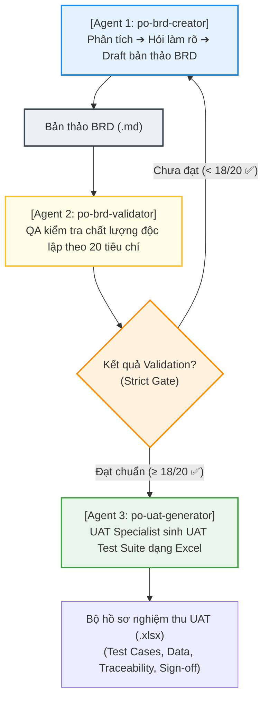

# 🏛️ MSB CTB Product Owner BRD Standards & AI Agent Hub

[](https://opensource.org/licenses/MIT)
[](#)
[](#)
[](#)

Chào mừng bạn đến với **MSB CTB Product Owner BRD Standards & AI Agent Hub**! 🚀

Tài nguyên này là bộ cẩm nang, biểu mẫu (templates) và tài liệu mẫu (sample BRDs) đặc tả yêu cầu nghiệp vụ (Business Requirement Document - BRD) chuẩn hóa cấp độ ngân hàng số bán lẻ hiện đại. Được đúc kết thực chiến qua việc phân tích và đồng bộ hàng chục dự án lớn, bộ tài nguyên này giải quyết triệt để vấn đề lớn nhất của Product Owners (PO) và Business Analysts (BA): **"Tài liệu viết mơ hồ, thiếu logic ngầm hệ thống, dẫn đến Dev hiểu sai và QA bỏ sót kịch bản kiểm thử."**

Đặc biệt, đây là bộ tiêu chuẩn đầu tiên được thiết kế tối ưu để **đào tạo và định hình AI PO Agents** thế hệ mới (Claude, ChatGPT, Gemini) cùng viết tài liệu nghiệp vụ chất lượng cao với bạn!

---

## 🌟 Tại sao bộ tiêu chuẩn này lại khác biệt?

Trái ngược với các tài liệu mô tả nghiệp vụ truyền thống vốn chỉ liệt kê màn hình tĩnh và tính năng sơ sài, bộ tiêu chuẩn **MSB CTB** định vị chất lượng BRD ở tầm cao mới:

*   **Tư duy As-is vs To-be rõ ràng:** Phân tích điểm gãy hành trình hiện tại và thiết kế quy trình tự động hóa STP (Straight-Through Processing) tối ưu nhất.
*   **Ma trận Đặc tả Nghiệp vụ (The Matrix Table):** Đặc tả chi tiết mối quan hệ giữa Thao tác khách hàng, Phản hồi hệ thống (Business Rules), và Bước đi tiếp theo (Next Action).
*   **Logic chốt chặn ngầm hệ thống (System Check Checklists):** Định nghĩa sẵn các cổng kiểm soát bảo mật (Root check, SMS OTP retry control, SMS/Smart OTP limits, Velocity Limits).
*   **Tuân thủ quy chuẩn Pháp lý & An toàn bảo mật:** Tích hợp sâu hướng xử lý định danh công dân VNeID/CCCD gắn chip và chốt chặn sinh trắc học Face Authen theo Quyết định 2345/QĐ-NHNN của Ngân hàng Nhà nước.
*   **Chuẩn hóa UI Copy & Popup:** Loại bỏ hoàn toàn ghi chú mơ hồ *"Hệ thống báo lỗi"*, thay vào đó đặc tả rõ ràng popup hiển thị gồm **Title**, **Content** dynamic, và nút hành động **CTA**.
*   **Bản đồ tích hợp dữ liệu (Data Mapping Schema):** Đồng bộ cấu trúc truyền nhận API giữa Front-end di động, Middleware (DIP), và các hệ thống Core Banking ngay trong tài liệu.

---

## 📂 Sơ đồ cấu trúc Hub Tài nguyên (Repository Map)

Dưới đây là cách chúng tôi tổ chức các tài nguyên để bạn và đội ngũ của mình dễ dàng khám phá:

```
po-brd-sharing-hub/
├── README.md                # Trang giới thiệu chính (Tài liệu này)
├── LICENSE                  # Giấy phép mã nguồn mở MIT
├── Templates/               # 📋 Thư mục chứa các mẫu BRD chuẩn hóa
│   ├── README.md            # Hướng dẫn chi tiết cách áp dụng các template
│   ├── brd_template_standard.md             # Mẫu BRD chuẩn cho nghiệp vụ chung
│   ├── brd_template_onboarding.md           # Mẫu BRD cho luồng eKYC, mở tài khoản
│   └── brd_template_transaction_lending.md  # Mẫu BRD cho luồng chuyển tiền, thanh toán, tín dụng
├── Guides/                  # 📖 Thư mục chứa cẩm nang & kỹ năng AI PO
│   ├── README.md            # Hướng dẫn sử dụng cẩm nang để đào tạo AI
│   ├── po_writing_guide_for_ai_agents.md    # Cẩm nang quy hoạch & chuẩn hóa viết BRD thực chiến
│   ├── po_brd_creator_skill.md              # [Agent 1] Kỹ năng phân tích & soạn thảo BRD draft
│   ├── po_brd_validator_skill.md            # [Agent 2] Kỹ năng QA validate chất lượng độc lập 20 tiêu chí
│   └── po_uat_generator_skill.md            # [Agent 3] Kỹ năng tự động sinh UAT Test Suite chuyên nghiệp
├── Payment/                 # 💳 Phân hệ Payment
│   └── UAT-PAY-VietQR_Scan_Transfer-20260525.xlsx  # Bộ UAT Test Suite VietQR chính thức dạng Excel
└── Samples/                 # 🚀 Thư mục chứa tài liệu BRD mẫu thực tế
    ├── README.md            # Tổng quan và hướng dẫn học tập từ các mẫu BRD
    ├── DCTBR-[Daily Banking] [Payment] Quét QR chuyển khoản VietQR.md  # BRD mẫu quét VietQR cao cấp (Ver 2.1)
    ├── UAT-PAY-VietQR_Scan_Transfer-20260525.xlsx  # Tệp UAT Test Suite mẫu dạng Excel
    └── sample_brd_atm_qr_withdrawal.md      # BRD mẫu rút tiền mặt QR tại cây ATM
```

---

## 🤖 Kiến trúc Quy trình Làm việc Multi-Agent mới (3-Agent Pipeline)

Nhằm tối ưu hóa chất lượng đặc tả và loại bỏ hoàn toàn các lỗi chủ quan từ một AI Agent duy nhất, quy trình đã được nâng cấp lên **Kiến trúc Multi-Agent liên kết 3 Agent chuyên biệt**:



*   **Agent 1 (po-brd-creator)**: Chịu trách nhiệm Phase 1 + 2 + 3. Trao đổi làm rõ nghiệp vụ và phác thảo bản thảo đặc tả đầu tiên.
*   **Agent 2 (po-brd-validator)**: Đóng vai QA Validator độc lập ("fresh reader"), chấm điểm khách quan theo 20-point checklist (Cấu trúc, Matrix, UI Popup, Mermaid, API, Chất lượng). Đạt $\ge 18/20$ và vượt qua các cổng kiểm soát nghiêm ngặt mới cho đi tiếp.
*   **Agent 3 (po-uat-generator)**: Đóng vai chuyên gia UAT, sinh bộ kịch bản kiểm thử nghiệp vụ chuyên nghiệp gồm 4 sheets có màu sắc, công thức tính toán và conditional formatting tự động.

---

## 📈 Lịch sử Phiên bản & Nhật ký Thay đổi

Theo dõi các bước phát triển, nâng cấp và chuẩn hóa quy trình biên soạn đặc tả tài liệu trong hệ thống:

| Phiên bản | Ngày cập nhật | Người thực hiện | Tóm tắt nội dung thay đổi nghiệp vụ & quy trình |
| :---: | :---: | :--- | :--- |
| **Ver 1.0** | 22/05/2026 | AI PO Agent | Khởi tạo Hub tiêu chuẩn, cung cấp các template (Standard, Onboarding, Transaction) và cẩm nang viết BRD thực chiến. |
| **Ver 2.0** | 25/05/2026 | Antigravity PO Agent | Nâng cấp tài liệu mẫu quét VietQR chuyển khoản (Ver 2.0) tích hợp 10 chốt chặn nghiệp vụ (Root check, Overdraft source, QĐ 2345 Face Authen, Reversal 30s...). |
| **Ver 2.1** | 25/05/2026 | Multi-Agent Team | **[MỚI NHẤT]** Thiết lập kiến trúc Multi-Agent 3 giai đoạn. Tinh gọn quy trình Agent 1 và bàn giao kiểm soát độc lập cho Agent 2 (Validate 20 tiêu chí) và Agent 3 (Tự động sinh UAT Test Suite dạng Excel). Hoàn thành bộ UAT Test Suite mẫu gửi vào thư mục `Samples/`. |

---

## 🚀 Hướng dẫn Bắt đầu Nhanh (Quick Start)

### Dành cho Product Owners & Business Analysts (Con người)
1.  **Học hỏi cẩm nang:** Đọc tệp [Guides/po_writing_guide_for_ai_agents.md](file:///Users/minhphuong/Documents/Ta%CC%80i%20lie%CC%A3%CC%82u%20Brd%20MSB%20CTB/Guides/po_writing_guide_for_ai_agents.md) để nắm vững các chốt chặn nghiệp vụ ngân hàng cần phải mô tả.
2.  **Sử dụng tài liệu mẫu để lấy cảm hứng:** Khám phá tệp [Samples/DCTBR-[Daily Banking] [Payment] Quét QR chuyển khoản VietQR.md](file:///Users/minhphuong/Documents/Ta%CC%80i%20lie%CC%A3%CC%82u%20Brd%20MSB%20CTB/Samples/DCTBR-%5BDaily%20Banking%5D%20%5BPayment%5D%20Que%CC%81t%20QR%20chuye%CC%82%CC%89n%20khoa%CC%81n%20VietQR.md) để học cách dựng một sơ đồ sequence bằng Mermaid và cách viết ma trận đặc tả hành trình.
3.  **Tải biểu mẫu để biên soạn:** Sao chép các tệp template trong thư mục `Templates/` và bắt đầu điền nội dung dự án mới của bạn.

### Dành cho AI Assistants (Trợ lý AI của bạn)
Bạn có thể đào tạo mô hình ngôn ngữ lớn (như Claude 3.5 Sonnet, GPT-4o, Gemini 1.5 Pro) để tự động đặc tả BRD chuẩn MSB CTB bằng cách:
1.  Đính kèm hoặc copy-paste tệp [Guides/po_writing_guide_for_ai_agents.md](file:///Users/minhphuong/Documents/Ta%CC%80i%20lie%CC%A3%CC%82u%20Brd%20MSB%20CTB/Guides/po_writing_guide_for_ai_agents.md) và tệp [Guides/po_brd_creator_skill.md](file:///Users/minhphuong/Documents/Ta%CC%80i%20lie%CC%A3%CC%82u%20Brd%20MSB%20CTB/Guides/po_brd_creator_skill.md).
2.  Nhập prompt:
    > *"Đọc hai tài liệu đính kèm để hiểu tiêu chuẩn PO của MSB CTB. Dựa trên đó, hãy phân tích yêu cầu sau đây và thực hiện Phase 2 (hỏi làm rõ nghiệp vụ): 'Tôi muốn làm chức năng Đăng ký tài khoản thanh toán trực tuyến tích hợp định danh VNeID cho Khách hàng mới.'"*

---

## 🤝 Đóng góp cho Cộng đồng (Contributing)

Mọi đóng góp từ cộng đồng Product Owner và FinTech tại Việt Nam đều được chào đón! Bạn có thể:
*   Mở một **Issue** để thảo luận về việc bổ sung các logic chốt chặn mới của Ngân hàng Nhà nước.
*   Gửi một **Pull Request** để cải tiến cấu trúc các biểu mẫu (Templates) ngày một hoàn thiện hơn.

---

## 📄 Bản quyền & Giấy phép (License)

Dự án này được cấp phép theo các điều khoản của **MIT License**. Bạn được toàn quyền tự do sao chép, sửa đổi, thương mại hóa hoặc chia sẻ cho tổ chức của mình mà không cần xin phép trước. Chi tiết xem tại tệp [LICENSE](file:///Users/minhphuong/Documents/Ta%CC%80i%20lie%CC%A3%CC%82u%20Brd%20MSB%20CTB/LICENSE).

---

*Chúc các Product Owners và AI Agents kiến tạo ra những sản phẩm số tuyệt vời với các tài liệu đặc tả hoàn hảo!* 🏦💻
