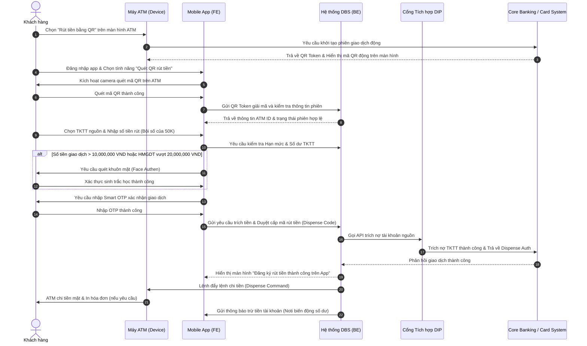

# TÀI LIỆU YÊU CẦU NGHIỆP VỤ (BRD)
## HÀNH TRÌNH RÚT TIỀN BẰNG MÃ QR TẠI ATM TRÊN MOBILE APP (ATM QR CARDLESS CASH WITHDRAWAL)
**Mã tài liệu:** BRD-[PAY-005] ATM QR Withdrawal  
**Phân hệ:** Daily Banking - Payment  
**Phiên bản:** Ver 1.0  
**Ngày cập nhật:** 22/05/2026  
**Trạng thái:** Released (Sample Learning Asset)

---

## 1. LỊCH SỬ THAY ĐỔI TÀI LIỆU

| Phiên bản | Ngày cập nhật | Người thực hiện | Người phê duyệt | Mô tả chi tiết thay đổi (A/M/D) |
| :--- | :--- | :--- | :--- | :--- |
| Ver 1.0 | 22/05/2026 | AI PO Agent | Stakeholder Approved | **[NEW]** Khởi tạo tài liệu đặc tả mẫu hoàn chỉnh cho tính năng rút tiền bằng mã QR tại ATM không dùng thẻ vật lý (Cardless). |

---

## 2. BỘ THUẬT NGỮ NGHIỆP VỤ & GIẢI THÍCH TỪ NGỮ

| STT | Thuật ngữ / Từ viết tắt | Giải thích ý nghĩa nghiệp vụ |
| :--- | :--- | :--- |
| 1 | **ATM** | Automated Teller Machine (Máy giao dịch tự động của ngân hàng). |
| 2 | **Cardless** | Giao dịch không cần sử dụng thẻ vật lý tại ATM. |
| 3 | **ATM QR Code** | Mã QR động chứa thông tin định danh của phiên giao dịch rút tiền được sinh ra trên màn hình máy ATM. |
| 4 | **Face Authen (FA)** | Xác thực khuôn mặt sinh trắc học theo Quyết định 2345/QĐ-NHNN. |
| 5 | **TKTT** | Tài khoản thanh toán nguồn trích tiền rút của khách hàng. |
| 6 | **DIP** | Digital Integration Platform (Cổng kết nối tích hợp dữ liệu API giữa Mobile App và Hệ thống Thẻ/Core). |
| 7 | **HMGDT** | Hạn mức giao dịch ngày (Tổng số tiền tối đa được rút trong 1 ngày). |

---

## 3. TỔNG QUAN HÀNH TRÌNH GIAO DỊCH
*   **Mô tả US**: Là một Khách hàng hiện hữu của MSB (ETB) đã cài đặt ứng dụng Mobile App, tôi muốn rút tiền mặt tại máy ATM của MSB bằng cách quét mã QR trên màn hình ATM để không cần phải mang theo thẻ vật lý và bảo vệ an toàn thông tin thẻ khỏi các rủi ro sao chép thiết bị (skimming).
*   **Mục đích**: Tăng tốc độ giao dịch tại ATM, nâng cao trải nghiệm số hóa không dùng thẻ vật lý (Cardless), giảm chi phí phát hành và vận hành thẻ nhựa cho ngân hàng.
*   **Phạm vi (In-Scope)**:
    *   Khách hàng sử dụng ứng dụng di động MSB Digibank quét mã QR động hiển thị trên màn hình ATM của MSB.
    *   Trích tiền từ Tài khoản thanh toán (TKTT) đang hoạt động liên kết với CIF của khách hàng.
    *   Xác thực bảo mật đa lớp gồm SMS/Smart OTP và Sinh trắc học Face Authen cho các giao dịch vượt ngưỡng quy định.

---

## 4. SƠ ĐỒ LUỒNG QUY TRÌNH NGHIỆP VỤ (MERMAID PROCESS FLOW)

Dưới đây là sơ đồ chuỗi hành trình giao dịch To-be thể hiện luồng truyền nhận giữa Mobile App, Máy ATM, Hệ thống quản trị kênh số DBS, cổng tích hợp DIP và Core Banking / Hệ thống Thẻ:

---

## 5. ĐẶC TẢ CHI TIẾT LUỒNG HÀNH TRÌNH & BUSINESS RULES

- **Kênh thực hiện**: Máy ATM vật lý và Ứng dụng di động MSB Digibank.
- **Điều kiện đầu vào**: 
    1.  Khách hàng đã đăng nhập ứng dụng Mobile App thành công.
    2.  Khách hàng đang đứng trực tiếp tại máy ATM hoạt động của MSB.
    3.  Tài khoản thanh toán (TKTT) nguồn của khách hàng ở trạng thái Hoạt động (`Active`), số dư khả dụng $\ge$ số tiền muốn rút + phí giao dịch (nếu có).

### Bảng Chi Tiết Hành Trình Từng Bước:

| Bước | Người thực hiện / PIC | Thao tác chi tiết | Logic nghiệp vụ & Kiểm tra ngầm hệ thống (Business Rules) | Kết quả & Chuyển bước tiếp theo |
| :---: | :--- | :--- | :--- | :--- |
| **1** | Khách hàng & ATM | Khách hàng chạm vào màn hình ATM, chọn ngôn ngữ và bấm nút `[Rút tiền bằng QR Code]`. | Máy ATM gọi API hệ thống Core để sinh mã QR giao dịch động. Mã QR động này chỉ có hiệu lực tối đa trong vòng **60 giây** kể từ khi hiển thị. | Màn hình ATM hiển thị mã QR động kèm đồng hồ đếm ngược 60s -> Chuyển sang **Bước 2**. |
| **2** | Khách hàng & App | Khách hàng mở Mobile App, chọn nhanh tính năng quét mã QR rút tiền tại màn hình Home hoặc menu dịch vụ. | 1. Hệ thống thực hiện kiểm tra Root/Jailbreak thiết bị.  2. Kích hoạt camera quét mã. Người dùng di chuyển camera quét mã QR động đang hiển thị trên màn hình ATM. | - Quét thành công: Giải mã QR Token và chuyển sang **Bước 3**.  - Quét lỗi / Quá 60s: ATM hiển thị thông báo phiên hết hiệu lực [ERR_ATM_TIMEOUT]. |
| **3** | Khách hàng & App | Khách hàng chọn Tài khoản thanh toán (TKTT) nguồn trích tiền và nhập số tiền cần rút. | 1. **Kiểm tra số tiền**: Số tiền rút phải là bội số của **50.000 VND** (do mệnh giá ATM cấp). Số tiền rút tối thiểu: **100.000 VND/giao dịch**, tối đa: **5.000.000 VND/giao dịch**.  2. **Kiểm tra hạn mức ngày**: Hệ thống check HMGDT rút tiền mặt không quá **100.000.000 VND/ngày**.  3. **Kiểm tra số dư khả dụng**: Số dư khả dụng của TKTT trích nợ phải $\ge$ Số tiền rút. | - Nếu Đạt điều kiện: Chuyển sang **Bước 4**.  - Nếu Lỗi hạn mức/Số dư: Hiển thị Popup cảnh báo số tiền rút không hợp lệ [ERR_LIMIT_EXCEEDED]. |
| **4** | Hệ thống App | Hệ thống tự động kiểm tra điều kiện xác thực sinh trắc học bắt buộc. | **Áp dụng quyết định 2345/QĐ-NHNN**:  - Nếu Số tiền giao dịch $> 10.000.000$ VND/lần HOẶC Tổng số tiền rút tiền QR tích lũy trong ngày $> 20.000.000$ VND -> Hệ thống tự động kích hoạt luồng Face Authen. | - Nếu Cần Face Authen: Chuyển sang luồng chụp ảnh khuôn mặt so khớp -> Khớp thành công chuyển sang **Bước 5**.  - Nếu Không cần: Bỏ qua Face Authen, chuyển sang **Bước 5** (Nhập Smart OTP). |
| **5** | Khách hàng & App | Khách hàng nhập Smart OTP (hoặc xác thực FaceID/TouchID đăng ký bảo mật) trên thiết bị di động để ký số giao dịch trích tiền. | Hệ thống kiểm tra tính khớp của Smart OTP.  - Nhập sai < 3 lần: Báo lỗi yêu cầu nhập lại.  - Nhập sai liên tiếp 3 lần: Khóa tính năng giao dịch tài chính trên App trong vòng 2 giờ. | - Đúng OTP: Thực hiện trừ tiền TKTT thành công tại Core, sinh mã nhận tiền chiết khấu (Dispense Auth) -> Chuyển sang **Bước 6**. |
| **6** | Hệ thống & ATM | Hệ thống DBS truyền lệnh chi tiền trực tiếp đến máy ATM cụ thể thông qua API kết nối máy vật lý. | 1. Hệ thống ATM kiểm tra lượng tiền mặt thực tế trong khay còn đủ cơ cấu mệnh giá chi tiền không.  2. Thực hiện nhả tiền vật lý tại khe khay tiền của ATM. | - ATM nhả tiền mặt thành công -> Chuyển sang màn hình thông báo giao dịch thành công tại ATM và trên App (**Bước 7**).  - ATM kẹt tiền / thiếu mệnh giá: Core tự động hoàn tiền (Reversal) vào TKTT của KH ngay lập tức, thông báo lỗi kẹt tiền tại ATM. |
| **7** | Hệ thống App | Hệ thống DBS gửi thông báo trừ tiền tài khoản nguồn của khách hàng. | Gửi thông báo biến động số dư tức thời (Noti in-app) cho khách hàng qua ứng dụng. | Kết thúc trọn vẹn hành trình. |

---

## 6. QUY CHUẨN THÔNG BÁO POPUP LỖI TRÊN GIAO DIỆN DI ĐỘNG

Dưới đây là thiết kế chi tiết nội dung hiển thị của các popup xử lý ngoại lệ trong luồng:

### Popup lỗi ERR_LIMIT_EXCEEDED: Vượt hạn mức rút tiền
*   **Tiêu đề (Title)**: Hạn mức giao dịch không hợp lệ
*   **Nội dung mô tả (Content)**: Số tiền Quý khách yêu cầu rút vượt quá số dư khả dụng tài khoản hoặc vượt hạn mức rút tiền mặt qua QR quy định (Tối thiểu 100.000 VND, Tối đa 5.000.000 VND/lần và 100.000.000 VND/ngày). Quý khách vui lòng kiểm tra lại thông tin.
*   **Nút hành động (CTA)**: `[Nhập lại số tiền]` -> Đóng popup và đưa con trỏ về ô nhập số tiền tại Bước 3.

### Popup lỗi ERR_ATM_TIMEOUT: Quét mã QR hết hạn
*   **Tiêu đề (Title)**: Phiên giao dịch hết hiệu lực
*   **Nội dung mô tả (Content)**: Mã QR trên máy ATM đã hết hiệu lực 60 giây. Quý khách vui lòng bấm nút "Giao dịch mới" trên màn hình máy ATM để tạo mã QR mới và quét lại.
*   **Nút hành động (CTA)**: `[Đóng]` -> Đóng popup và đưa người dùng trở lại trang chủ Digibank.

---

## 7. ĐẶC TẢ TÍCH HỢP DỮ LIỆU & DATA MAPPING SCHEMAS

### Bảng 7.1: Dữ liệu Yêu cầu Xác thực QR và Trích tiền gửi từ App (DC) lên Cổng DIP/Core
| Tên Trường (Tiếng Việt) | Mã trường hệ thống | Kiểu dữ liệu | Thuộc tính (M/O) | Mô tả logic / Quy tắc nguồn |
| :--- | :--- | :--- | :---: | :--- |
| Mã thiết bị ATM | `atm_device_id` | String | M | Mã nhận diện duy nhất của cây ATM vật lý lấy từ việc giải mã QR Token. |
| Tài khoản trích nợ | `source_account_id` | String | M | Số tài khoản thanh toán nguồn trích tiền do khách hàng chọn trên UI. |
| Số tiền rút | `withdrawal_amount` | Decimal | M | Số tiền mặt khách hàng muốn rút (Phải $\ge 100,000$ và là bội số của 50k). |
| Token Giao dịch QR | `qr_transaction_token` | String | M | Token mã hóa phiên giao dịch sinh từ máy ATM để DBS đối khớp. |
| Chữ ký bảo mật | `smart_otp_signature` | String | M | Token bảo mật sinh ra sau khi xác thực Smart OTP thành công để thực hiện lệnh ký số trích nợ. |

### Bảng 7.2: Dữ liệu Trả về từ Core Banking / Hệ thống Thẻ
| Tên Trường (Tiếng Việt) | Mã trường hệ thống | Kiểu dữ liệu | Thuộc tính (M/O) | Mô tả logic / Giá trị trả về |
| :--- | :--- | :--- | :---: | :--- |
| Mã kết quả xử lý | `response_code` | String | M | Trả về `00` nếu trích tiền Core thành công và được phép ATM nhả tiền; Trả về mã lỗi (ví dụ: `09` - Số dư không đủ) nếu thất bại. |
| Mã ủy quyền nhả tiền | `dispense_auth_code` | String | M | Mã token chứng thực cấp cho máy ATM để thực thi lệnh chi tiền vật lý. |
| Mã tham chiếu giao dịch | `transaction_reference_id` | String | M | Mã giao dịch duy nhất dùng để đối soát và tra soát sau này. |

---

## 8. THÔNG BÁO ĐA KÊNH GIAO DỊCH (NOTI SPEC)

### 8.1. Thông báo biến động số dư qua Notification Center (Push Noti)
*   **Điều kiện gửi**: Ngay sau khi Core trích nợ thành công tại Bước 5.
*   **Tiêu đề**: Biến động số dư tài khoản
*   **Nội dung**: `Tài khoản {source_account_id} của Quý khách đã trích nợ -{withdrawal_amount} VND cho giao dịch Rút tiền bằng QR tại ATM {atm_device_id} thành công. Số dư khả dụng hiện tại là {available_balance} VND. Cảm ơn Quý khách!`

### 8.2. Thông báo SMS Tra soát (Gửi khi giao dịch lỗi cần hoàn tiền tự động)
*   **Điều kiện gửi**: Kích hoạt khi ATM kẹt tiền không chi được tiền vật lý tại Bước 6.
*   **Nội dung**: `MSB Digibank: Giao dich rut tien QR tai ATM {atm_device_id} số tiền {withdrawal_amount} VND chua hoan tat do loi thiet bi. MSB da thuc hien hoan tien tu dong vao TKTT cua Quy khach. Hotline ho tro 1900xxxx.`
